# Lab: Introduction to Python


```python
import numpy as np

rng = np.random.default_rng(1303)
print(rng.normal(scale=5, size=2))
rng2 = np.random.default_rng(1303)
print(rng2.normal(scale=5, size=2))
```

    [ 4.09482632 -1.07485605]
    [ 4.09482632 -1.07485605]


```python
rng = np.random.default_rng(3)
y = rng.standard_normal(10)
np.mean(y), y.mean()
```


    (-0.1126795190952861, -0.1126795190952861)


```python
np.var(y), y.var(), np.mean((y - y.mean()) ** 2)
```


    (2.7243406406465125, 2.7243406406465125, 2.7243406406465125)


```python
np.sqrt(np.var(y)), y.std()
```


    (1.6505576756498128, 1.6505576756498128)


```python
X = rng.standard_normal((10, 3))
X
```


    array([[ 0.32802009, -0.60921614,  1.59064023],
           [-1.19122668,  0.35453195, -1.04840552],
           [ 1.40596294, -0.02165123, -0.37225056],
           [-1.71818495,  1.68182555,  0.75277859],
           [ 0.75356384,  1.13788126,  0.34922658],
           [-0.63924661, -0.80024123, -0.80019998],
           [ 1.37007234, -1.4603812 , -0.59636951],
           [-0.32124392,  0.22461903,  0.57534939],
           [-1.24909701, -1.73001345, -0.00441423],
           [ 1.21356383,  0.75705806,  0.21565078]])


```python
X.mean(axis=0), X.mean(0)
```


    (array([-0.00478161, -0.04655874,  0.06620058]),
     array([-0.00478161, -0.04655874,  0.06620058]))


```python
X.mean(axis=1), X.mean(1)
```


    (array([ 0.4364814 , -0.62836675,  0.33735372,  0.2388064 ,  0.74689056,
            -0.74656261, -0.22889279,  0.15957483, -0.99450823,  0.72875756]),
     array([ 0.4364814 , -0.62836675,  0.33735372,  0.2388064 ,  0.74689056,
            -0.74656261, -0.22889279,  0.15957483, -0.99450823,  0.72875756]))


## Graphics


```python
from matplotlib.pyplot import subplots

rng = np.random.default_rng(1303)

fig, ax = subplots(figsize=(8, 8))
x = rng.standard_normal(100)
y = rng.standard_normal(100)

# The semicolon prevents printing the text.
ax.plot(x, y, "o");
```


    
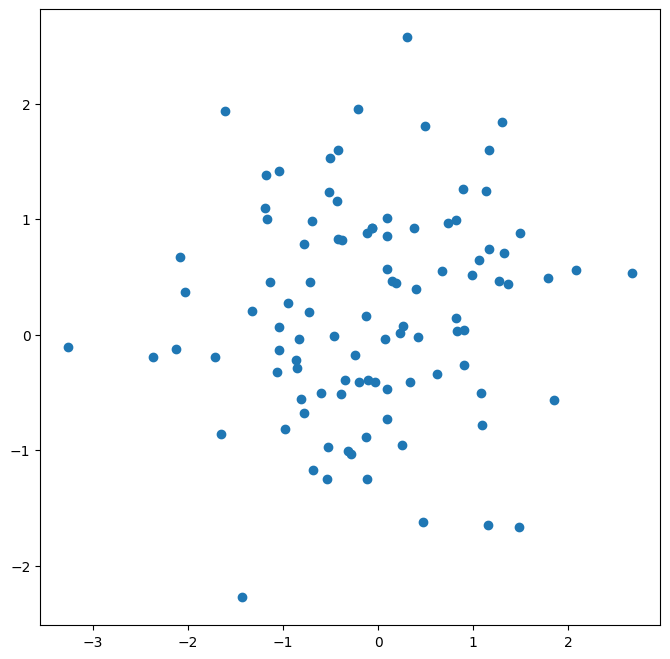
    


```python
fix, ax = subplots(figsize=(8, 8))
ax.scatter(x, y, marker="o")
```


    <matplotlib.collections.PathCollection at 0x11598b690>


    

    


```python
fig, ax = subplots(figsize=(8, 8))
ax.scatter(x, y, marker="o")
ax.set_xlabel("this is the x-axis")
ax.set_ylabel("this is the y-axis")
ax.set_title("Plot of X vs Y");
```


    
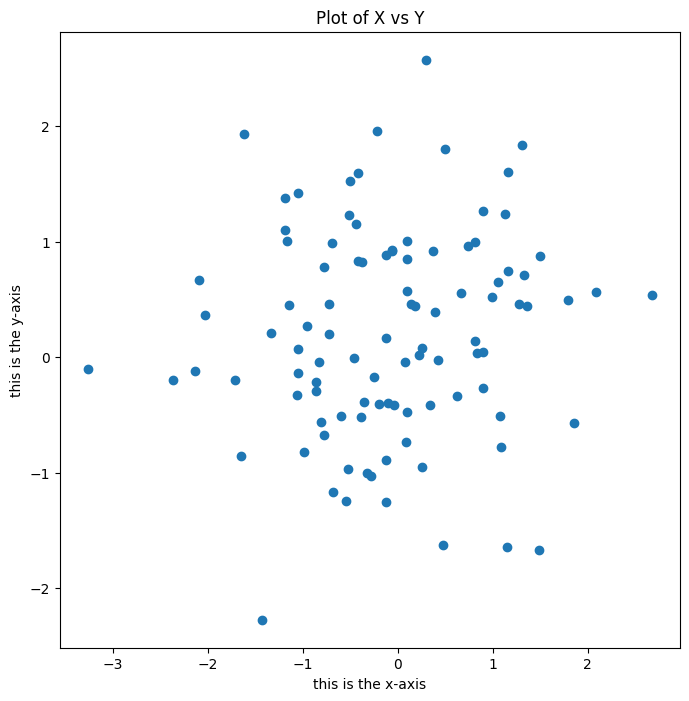
    


```python
fig, axes = subplots(nrows=2, ncols=3, figsize=(15, 5))
axes[0, 1].plot(x, y, "o")
axes[1, 2].scatter(x, y, marker="+");
```


    
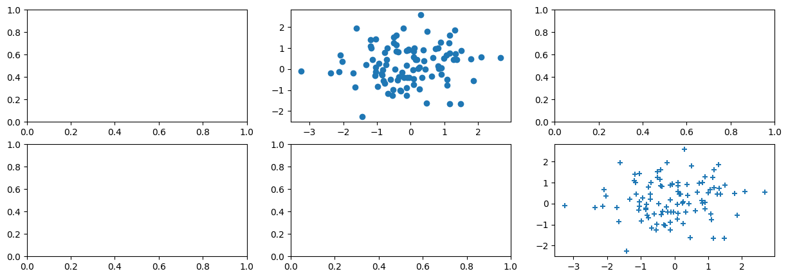
    


```python
fig, ax = subplots(figsize=(8, 8))
x = np.linspace(-np.pi, np.pi, 50)
y = x
f = np.multiply.outer(np.cos(y), 1 / (1 + x**2))
ax.contour(x, y, f);
```


    
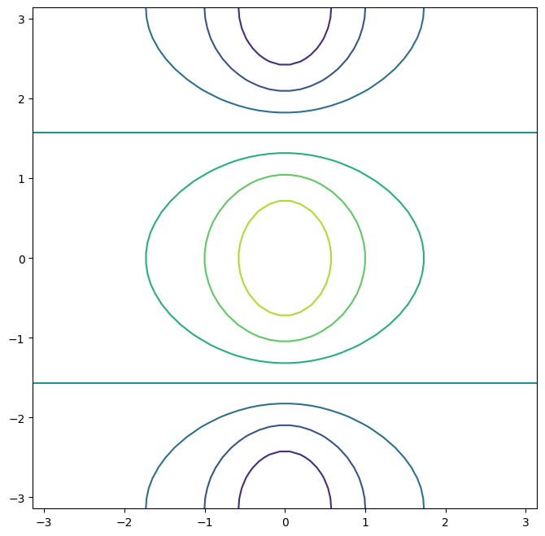
    


```python
# We can increase the resolution by adding more levels to the image.
fig, ax = subplots(figsize=(8, 8))
ax.contour(x, y, f, levels=45);
```


    
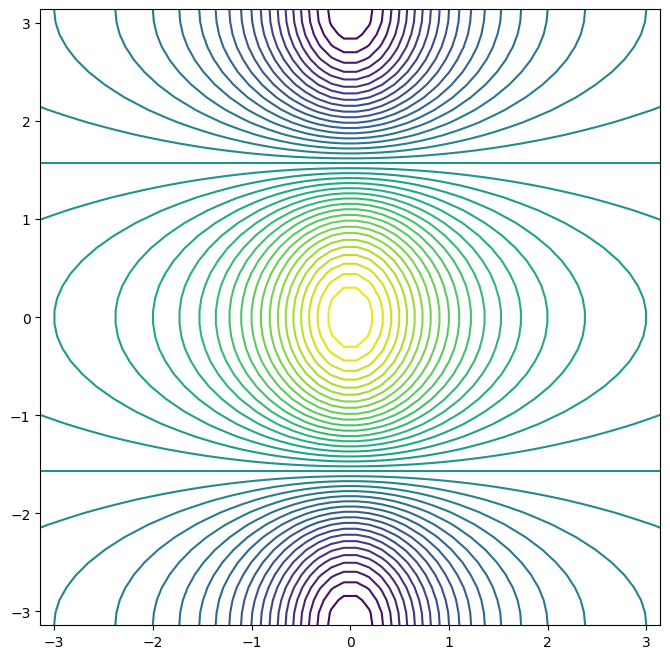
    


```python
# ax.imshow() method is similar to ax.contour(), except that it produces a color-coded plot
# whose colors depend on the z value.
fig, ax = subplots(figsize=(8, 8))
ax.imshow(f);
```


    
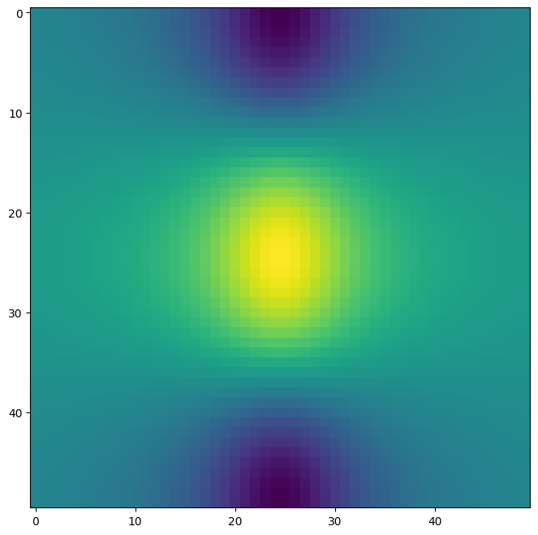
    


## Sequences and Slice Notation


```python
seq1 = np.linspace(0, 10, 11)
seq1
```


    array([ 0.,  1.,  2.,  3.,  4.,  5.,  6.,  7.,  8.,  9., 10.])


```python
seq2 = np.arange(0, 10)
seq2
```


    array([0, 1, 2, 3, 4, 5, 6, 7, 8, 9])


```python
A = np.array(np.arange(16)).reshape((4, 4))
A
```


    array([[ 0,  1,  2,  3],
           [ 4,  5,  6,  7],
           [ 8,  9, 10, 11],
           [12, 13, 14, 15]])


```python
A[1, 2]
```


    6


```python
# Retrieve the 2nd and 4th row.
A[[1, 3]]
```


    array([[ 4,  5,  6,  7],
           [12, 13, 14, 15]])


```python
# Retrieve the 1st and 3rd col.
A[:, [0, 2]]
```


    array([[ 0,  2],
           [ 4,  6],
           [ 8, 10],
           [12, 14]])


```python
A[[1, 3], [0, 2]]
```


    array([ 4, 14])


```python
A[[1, 3]][:, [0, 2]]
```


    array([[ 4,  6],
           [12, 14]])


```python
idx = np.ix_([1, 3], [0, 2, 3])
A[idx]
```


    array([[ 4,  6,  7],
           [12, 14, 15]])


```python
A[1:4:2, 0:3:2]
```


    array([[ 4,  6],
           [12, 14]])


```python
keep_rows = np.zeros(A.shape[0], bool)
keep_rows
```


    array([False, False, False, False])


```python
keep_rows[[1, 3]] = True
keep_rows
```


    array([False,  True, False,  True])


```python
np.all(keep_rows == np.array([0, 1, 0, 1]))
```


    True


```python
# Retrieves the first, second, first and second rows of A.
A[[0, 1, 0, 1]]
```


    array([[0, 1, 2, 3],
           [4, 5, 6, 7],
           [0, 1, 2, 3],
           [4, 5, 6, 7]])


```python
# Retrieves only the second and fourth row of A.
A[keep_rows]
```


    array([[ 4,  5,  6,  7],
           [12, 13, 14, 15]])


## Loading Data


```python
import pandas as pd

Auto = pd.read_csv("data/Auto.csv")
Auto
```


<div>
<style scoped>
    .dataframe tbody tr th:only-of-type {
        vertical-align: middle;
    }

    .dataframe tbody tr th {
        vertical-align: top;
    }

    .dataframe thead th {
        text-align: right;
    }
</style>
<table border="1" class="dataframe">
  <thead>
    <tr style="text-align: right;">
      <th></th>
      <th>mpg</th>
      <th>cylinders</th>
      <th>displacement</th>
      <th>horsepower</th>
      <th>weight</th>
      <th>acceleration</th>
      <th>year</th>
      <th>origin</th>
      <th>name</th>
    </tr>
  </thead>
  <tbody>
    <tr>
      <th>0</th>
      <td>18.0</td>
      <td>8</td>
      <td>307.0</td>
      <td>130</td>
      <td>3504</td>
      <td>12.0</td>
      <td>70</td>
      <td>1</td>
      <td>chevrolet chevelle malibu</td>
    </tr>
    <tr>
      <th>1</th>
      <td>15.0</td>
      <td>8</td>
      <td>350.0</td>
      <td>165</td>
      <td>3693</td>
      <td>11.5</td>
      <td>70</td>
      <td>1</td>
      <td>buick skylark 320</td>
    </tr>
    <tr>
      <th>2</th>
      <td>18.0</td>
      <td>8</td>
      <td>318.0</td>
      <td>150</td>
      <td>3436</td>
      <td>11.0</td>
      <td>70</td>
      <td>1</td>
      <td>plymouth satellite</td>
    </tr>
    <tr>
      <th>3</th>
      <td>16.0</td>
      <td>8</td>
      <td>304.0</td>
      <td>150</td>
      <td>3433</td>
      <td>12.0</td>
      <td>70</td>
      <td>1</td>
      <td>amc rebel sst</td>
    </tr>
    <tr>
      <th>4</th>
      <td>17.0</td>
      <td>8</td>
      <td>302.0</td>
      <td>140</td>
      <td>3449</td>
      <td>10.5</td>
      <td>70</td>
      <td>1</td>
      <td>ford torino</td>
    </tr>
    <tr>
      <th>...</th>
      <td>...</td>
      <td>...</td>
      <td>...</td>
      <td>...</td>
      <td>...</td>
      <td>...</td>
      <td>...</td>
      <td>...</td>
      <td>...</td>
    </tr>
    <tr>
      <th>392</th>
      <td>27.0</td>
      <td>4</td>
      <td>140.0</td>
      <td>86</td>
      <td>2790</td>
      <td>15.6</td>
      <td>82</td>
      <td>1</td>
      <td>ford mustang gl</td>
    </tr>
    <tr>
      <th>393</th>
      <td>44.0</td>
      <td>4</td>
      <td>97.0</td>
      <td>52</td>
      <td>2130</td>
      <td>24.6</td>
      <td>82</td>
      <td>2</td>
      <td>vw pickup</td>
    </tr>
    <tr>
      <th>394</th>
      <td>32.0</td>
      <td>4</td>
      <td>135.0</td>
      <td>84</td>
      <td>2295</td>
      <td>11.6</td>
      <td>82</td>
      <td>1</td>
      <td>dodge rampage</td>
    </tr>
    <tr>
      <th>395</th>
      <td>28.0</td>
      <td>4</td>
      <td>120.0</td>
      <td>79</td>
      <td>2625</td>
      <td>18.6</td>
      <td>82</td>
      <td>1</td>
      <td>ford ranger</td>
    </tr>
    <tr>
      <th>396</th>
      <td>31.0</td>
      <td>4</td>
      <td>119.0</td>
      <td>82</td>
      <td>2720</td>
      <td>19.4</td>
      <td>82</td>
      <td>1</td>
      <td>chevy s-10</td>
    </tr>
  </tbody>
</table>
<p>397 rows × 9 columns</p>
</div>


```python
Auto = pd.read_csv("data/Auto.data", sep="\s+")
Auto
```


<div>
<style scoped>
    .dataframe tbody tr th:only-of-type {
        vertical-align: middle;
    }

    .dataframe tbody tr th {
        vertical-align: top;
    }

    .dataframe thead th {
        text-align: right;
    }
</style>
<table border="1" class="dataframe">
  <thead>
    <tr style="text-align: right;">
      <th></th>
      <th>mpg</th>
      <th>cylinders</th>
      <th>displacement</th>
      <th>horsepower</th>
      <th>weight</th>
      <th>acceleration</th>
      <th>year</th>
      <th>origin</th>
      <th>name</th>
    </tr>
  </thead>
  <tbody>
    <tr>
      <th>0</th>
      <td>18.0</td>
      <td>8</td>
      <td>307.0</td>
      <td>130.0</td>
      <td>3504.0</td>
      <td>12.0</td>
      <td>70</td>
      <td>1</td>
      <td>chevrolet chevelle malibu</td>
    </tr>
    <tr>
      <th>1</th>
      <td>15.0</td>
      <td>8</td>
      <td>350.0</td>
      <td>165.0</td>
      <td>3693.0</td>
      <td>11.5</td>
      <td>70</td>
      <td>1</td>
      <td>buick skylark 320</td>
    </tr>
    <tr>
      <th>2</th>
      <td>18.0</td>
      <td>8</td>
      <td>318.0</td>
      <td>150.0</td>
      <td>3436.0</td>
      <td>11.0</td>
      <td>70</td>
      <td>1</td>
      <td>plymouth satellite</td>
    </tr>
    <tr>
      <th>3</th>
      <td>16.0</td>
      <td>8</td>
      <td>304.0</td>
      <td>150.0</td>
      <td>3433.0</td>
      <td>12.0</td>
      <td>70</td>
      <td>1</td>
      <td>amc rebel sst</td>
    </tr>
    <tr>
      <th>4</th>
      <td>17.0</td>
      <td>8</td>
      <td>302.0</td>
      <td>140.0</td>
      <td>3449.0</td>
      <td>10.5</td>
      <td>70</td>
      <td>1</td>
      <td>ford torino</td>
    </tr>
    <tr>
      <th>...</th>
      <td>...</td>
      <td>...</td>
      <td>...</td>
      <td>...</td>
      <td>...</td>
      <td>...</td>
      <td>...</td>
      <td>...</td>
      <td>...</td>
    </tr>
    <tr>
      <th>392</th>
      <td>27.0</td>
      <td>4</td>
      <td>140.0</td>
      <td>86.00</td>
      <td>2790.0</td>
      <td>15.6</td>
      <td>82</td>
      <td>1</td>
      <td>ford mustang gl</td>
    </tr>
    <tr>
      <th>393</th>
      <td>44.0</td>
      <td>4</td>
      <td>97.0</td>
      <td>52.00</td>
      <td>2130.0</td>
      <td>24.6</td>
      <td>82</td>
      <td>2</td>
      <td>vw pickup</td>
    </tr>
    <tr>
      <th>394</th>
      <td>32.0</td>
      <td>4</td>
      <td>135.0</td>
      <td>84.00</td>
      <td>2295.0</td>
      <td>11.6</td>
      <td>82</td>
      <td>1</td>
      <td>dodge rampage</td>
    </tr>
    <tr>
      <th>395</th>
      <td>28.0</td>
      <td>4</td>
      <td>120.0</td>
      <td>79.00</td>
      <td>2625.0</td>
      <td>18.6</td>
      <td>82</td>
      <td>1</td>
      <td>ford ranger</td>
    </tr>
    <tr>
      <th>396</th>
      <td>31.0</td>
      <td>4</td>
      <td>119.0</td>
      <td>82.00</td>
      <td>2720.0</td>
      <td>19.4</td>
      <td>82</td>
      <td>1</td>
      <td>chevy s-10</td>
    </tr>
  </tbody>
</table>
<p>397 rows × 9 columns</p>
</div>


```python
Auto["horsepower"]
```


    0      130.0
    1      165.0
    2      150.0
    3      150.0
    4      140.0
           ...  
    392    86.00
    393    52.00
    394    84.00
    395    79.00
    396    82.00
    Name: horsepower, Length: 397, dtype: object


```python
np.unique(Auto["horsepower"])
```


    array(['100.0', '102.0', '103.0', '105.0', '107.0', '108.0', '110.0',
           '112.0', '113.0', '115.0', '116.0', '120.0', '122.0', '125.0',
           '129.0', '130.0', '132.0', '133.0', '135.0', '137.0', '138.0',
           '139.0', '140.0', '142.0', '145.0', '148.0', '149.0', '150.0',
           '152.0', '153.0', '155.0', '158.0', '160.0', '165.0', '167.0',
           '170.0', '175.0', '180.0', '190.0', '193.0', '198.0', '200.0',
           '208.0', '210.0', '215.0', '220.0', '225.0', '230.0', '46.00',
           '48.00', '49.00', '52.00', '53.00', '54.00', '58.00', '60.00',
           '61.00', '62.00', '63.00', '64.00', '65.00', '66.00', '67.00',
           '68.00', '69.00', '70.00', '71.00', '72.00', '74.00', '75.00',
           '76.00', '77.00', '78.00', '79.00', '80.00', '81.00', '82.00',
           '83.00', '84.00', '85.00', '86.00', '87.00', '88.00', '89.00',
           '90.00', '91.00', '92.00', '93.00', '94.00', '95.00', '96.00',
           '97.00', '98.00', '?'], dtype=object)


```python
# Replace '?' with np.nan.
Auto = pd.read_csv("data/Auto.data", na_values=["?"], sep="\s+")
Auto["horsepower"].sum()
```


    40952.0


```python
Auto.shape
```


    (397, 9)


```python
Auto_new = Auto.dropna()
Auto_new.shape
```


    (392, 9)


```python
Auto = Auto_new
Auto.columns
```


    Index(['mpg', 'cylinders', 'displacement', 'horsepower', 'weight',
           'acceleration', 'year', 'origin', 'name'],
          dtype='object')


```python
Auto[:3]
```


<div>
<style scoped>
    .dataframe tbody tr th:only-of-type {
        vertical-align: middle;
    }

    .dataframe tbody tr th {
        vertical-align: top;
    }

    .dataframe thead th {
        text-align: right;
    }
</style>
<table border="1" class="dataframe">
  <thead>
    <tr style="text-align: right;">
      <th></th>
      <th>mpg</th>
      <th>cylinders</th>
      <th>displacement</th>
      <th>horsepower</th>
      <th>weight</th>
      <th>acceleration</th>
      <th>year</th>
      <th>origin</th>
      <th>name</th>
    </tr>
  </thead>
  <tbody>
    <tr>
      <th>0</th>
      <td>18.0</td>
      <td>8</td>
      <td>307.0</td>
      <td>130.0</td>
      <td>3504.0</td>
      <td>12.0</td>
      <td>70</td>
      <td>1</td>
      <td>chevrolet chevelle malibu</td>
    </tr>
    <tr>
      <th>1</th>
      <td>15.0</td>
      <td>8</td>
      <td>350.0</td>
      <td>165.0</td>
      <td>3693.0</td>
      <td>11.5</td>
      <td>70</td>
      <td>1</td>
      <td>buick skylark 320</td>
    </tr>
    <tr>
      <th>2</th>
      <td>18.0</td>
      <td>8</td>
      <td>318.0</td>
      <td>150.0</td>
      <td>3436.0</td>
      <td>11.0</td>
      <td>70</td>
      <td>1</td>
      <td>plymouth satellite</td>
    </tr>
  </tbody>
</table>
</div>


```python
idx_80 = Auto["year"] > 80
Auto[idx_80]
```


<div>
<style scoped>
    .dataframe tbody tr th:only-of-type {
        vertical-align: middle;
    }

    .dataframe tbody tr th {
        vertical-align: top;
    }

    .dataframe thead th {
        text-align: right;
    }
</style>
<table border="1" class="dataframe">
  <thead>
    <tr style="text-align: right;">
      <th></th>
      <th>mpg</th>
      <th>cylinders</th>
      <th>displacement</th>
      <th>horsepower</th>
      <th>weight</th>
      <th>acceleration</th>
      <th>year</th>
      <th>origin</th>
      <th>name</th>
    </tr>
  </thead>
  <tbody>
    <tr>
      <th>338</th>
      <td>27.2</td>
      <td>4</td>
      <td>135.0</td>
      <td>84.0</td>
      <td>2490.0</td>
      <td>15.7</td>
      <td>81</td>
      <td>1</td>
      <td>plymouth reliant</td>
    </tr>
    <tr>
      <th>339</th>
      <td>26.6</td>
      <td>4</td>
      <td>151.0</td>
      <td>84.0</td>
      <td>2635.0</td>
      <td>16.4</td>
      <td>81</td>
      <td>1</td>
      <td>buick skylark</td>
    </tr>
    <tr>
      <th>340</th>
      <td>25.8</td>
      <td>4</td>
      <td>156.0</td>
      <td>92.0</td>
      <td>2620.0</td>
      <td>14.4</td>
      <td>81</td>
      <td>1</td>
      <td>dodge aries wagon (sw)</td>
    </tr>
    <tr>
      <th>341</th>
      <td>23.5</td>
      <td>6</td>
      <td>173.0</td>
      <td>110.0</td>
      <td>2725.0</td>
      <td>12.6</td>
      <td>81</td>
      <td>1</td>
      <td>chevrolet citation</td>
    </tr>
    <tr>
      <th>342</th>
      <td>30.0</td>
      <td>4</td>
      <td>135.0</td>
      <td>84.0</td>
      <td>2385.0</td>
      <td>12.9</td>
      <td>81</td>
      <td>1</td>
      <td>plymouth reliant</td>
    </tr>
    <tr>
      <th>343</th>
      <td>39.1</td>
      <td>4</td>
      <td>79.0</td>
      <td>58.0</td>
      <td>1755.0</td>
      <td>16.9</td>
      <td>81</td>
      <td>3</td>
      <td>toyota starlet</td>
    </tr>
    <tr>
      <th>344</th>
      <td>39.0</td>
      <td>4</td>
      <td>86.0</td>
      <td>64.0</td>
      <td>1875.0</td>
      <td>16.4</td>
      <td>81</td>
      <td>1</td>
      <td>plymouth champ</td>
    </tr>
    <tr>
      <th>345</th>
      <td>35.1</td>
      <td>4</td>
      <td>81.0</td>
      <td>60.0</td>
      <td>1760.0</td>
      <td>16.1</td>
      <td>81</td>
      <td>3</td>
      <td>honda civic 1300</td>
    </tr>
    <tr>
      <th>346</th>
      <td>32.3</td>
      <td>4</td>
      <td>97.0</td>
      <td>67.0</td>
      <td>2065.0</td>
      <td>17.8</td>
      <td>81</td>
      <td>3</td>
      <td>subaru</td>
    </tr>
    <tr>
      <th>347</th>
      <td>37.0</td>
      <td>4</td>
      <td>85.0</td>
      <td>65.0</td>
      <td>1975.0</td>
      <td>19.4</td>
      <td>81</td>
      <td>3</td>
      <td>datsun 210 mpg</td>
    </tr>
    <tr>
      <th>348</th>
      <td>37.7</td>
      <td>4</td>
      <td>89.0</td>
      <td>62.0</td>
      <td>2050.0</td>
      <td>17.3</td>
      <td>81</td>
      <td>3</td>
      <td>toyota tercel</td>
    </tr>
    <tr>
      <th>349</th>
      <td>34.1</td>
      <td>4</td>
      <td>91.0</td>
      <td>68.0</td>
      <td>1985.0</td>
      <td>16.0</td>
      <td>81</td>
      <td>3</td>
      <td>mazda glc 4</td>
    </tr>
    <tr>
      <th>350</th>
      <td>34.7</td>
      <td>4</td>
      <td>105.0</td>
      <td>63.0</td>
      <td>2215.0</td>
      <td>14.9</td>
      <td>81</td>
      <td>1</td>
      <td>plymouth horizon 4</td>
    </tr>
    <tr>
      <th>351</th>
      <td>34.4</td>
      <td>4</td>
      <td>98.0</td>
      <td>65.0</td>
      <td>2045.0</td>
      <td>16.2</td>
      <td>81</td>
      <td>1</td>
      <td>ford escort 4w</td>
    </tr>
    <tr>
      <th>352</th>
      <td>29.9</td>
      <td>4</td>
      <td>98.0</td>
      <td>65.0</td>
      <td>2380.0</td>
      <td>20.7</td>
      <td>81</td>
      <td>1</td>
      <td>ford escort 2h</td>
    </tr>
    <tr>
      <th>353</th>
      <td>33.0</td>
      <td>4</td>
      <td>105.0</td>
      <td>74.0</td>
      <td>2190.0</td>
      <td>14.2</td>
      <td>81</td>
      <td>2</td>
      <td>volkswagen jetta</td>
    </tr>
    <tr>
      <th>355</th>
      <td>33.7</td>
      <td>4</td>
      <td>107.0</td>
      <td>75.0</td>
      <td>2210.0</td>
      <td>14.4</td>
      <td>81</td>
      <td>3</td>
      <td>honda prelude</td>
    </tr>
    <tr>
      <th>356</th>
      <td>32.4</td>
      <td>4</td>
      <td>108.0</td>
      <td>75.0</td>
      <td>2350.0</td>
      <td>16.8</td>
      <td>81</td>
      <td>3</td>
      <td>toyota corolla</td>
    </tr>
    <tr>
      <th>357</th>
      <td>32.9</td>
      <td>4</td>
      <td>119.0</td>
      <td>100.0</td>
      <td>2615.0</td>
      <td>14.8</td>
      <td>81</td>
      <td>3</td>
      <td>datsun 200sx</td>
    </tr>
    <tr>
      <th>358</th>
      <td>31.6</td>
      <td>4</td>
      <td>120.0</td>
      <td>74.0</td>
      <td>2635.0</td>
      <td>18.3</td>
      <td>81</td>
      <td>3</td>
      <td>mazda 626</td>
    </tr>
    <tr>
      <th>359</th>
      <td>28.1</td>
      <td>4</td>
      <td>141.0</td>
      <td>80.0</td>
      <td>3230.0</td>
      <td>20.4</td>
      <td>81</td>
      <td>2</td>
      <td>peugeot 505s turbo diesel</td>
    </tr>
    <tr>
      <th>360</th>
      <td>30.7</td>
      <td>6</td>
      <td>145.0</td>
      <td>76.0</td>
      <td>3160.0</td>
      <td>19.6</td>
      <td>81</td>
      <td>2</td>
      <td>volvo diesel</td>
    </tr>
    <tr>
      <th>361</th>
      <td>25.4</td>
      <td>6</td>
      <td>168.0</td>
      <td>116.0</td>
      <td>2900.0</td>
      <td>12.6</td>
      <td>81</td>
      <td>3</td>
      <td>toyota cressida</td>
    </tr>
    <tr>
      <th>362</th>
      <td>24.2</td>
      <td>6</td>
      <td>146.0</td>
      <td>120.0</td>
      <td>2930.0</td>
      <td>13.8</td>
      <td>81</td>
      <td>3</td>
      <td>datsun 810 maxima</td>
    </tr>
    <tr>
      <th>363</th>
      <td>22.4</td>
      <td>6</td>
      <td>231.0</td>
      <td>110.0</td>
      <td>3415.0</td>
      <td>15.8</td>
      <td>81</td>
      <td>1</td>
      <td>buick century</td>
    </tr>
    <tr>
      <th>364</th>
      <td>26.6</td>
      <td>8</td>
      <td>350.0</td>
      <td>105.0</td>
      <td>3725.0</td>
      <td>19.0</td>
      <td>81</td>
      <td>1</td>
      <td>oldsmobile cutlass ls</td>
    </tr>
    <tr>
      <th>365</th>
      <td>20.2</td>
      <td>6</td>
      <td>200.0</td>
      <td>88.0</td>
      <td>3060.0</td>
      <td>17.1</td>
      <td>81</td>
      <td>1</td>
      <td>ford granada gl</td>
    </tr>
    <tr>
      <th>366</th>
      <td>17.6</td>
      <td>6</td>
      <td>225.0</td>
      <td>85.0</td>
      <td>3465.0</td>
      <td>16.6</td>
      <td>81</td>
      <td>1</td>
      <td>chrysler lebaron salon</td>
    </tr>
    <tr>
      <th>367</th>
      <td>28.0</td>
      <td>4</td>
      <td>112.0</td>
      <td>88.0</td>
      <td>2605.0</td>
      <td>19.6</td>
      <td>82</td>
      <td>1</td>
      <td>chevrolet cavalier</td>
    </tr>
    <tr>
      <th>368</th>
      <td>27.0</td>
      <td>4</td>
      <td>112.0</td>
      <td>88.0</td>
      <td>2640.0</td>
      <td>18.6</td>
      <td>82</td>
      <td>1</td>
      <td>chevrolet cavalier wagon</td>
    </tr>
    <tr>
      <th>369</th>
      <td>34.0</td>
      <td>4</td>
      <td>112.0</td>
      <td>88.0</td>
      <td>2395.0</td>
      <td>18.0</td>
      <td>82</td>
      <td>1</td>
      <td>chevrolet cavalier 2-door</td>
    </tr>
    <tr>
      <th>370</th>
      <td>31.0</td>
      <td>4</td>
      <td>112.0</td>
      <td>85.0</td>
      <td>2575.0</td>
      <td>16.2</td>
      <td>82</td>
      <td>1</td>
      <td>pontiac j2000 se hatchback</td>
    </tr>
    <tr>
      <th>371</th>
      <td>29.0</td>
      <td>4</td>
      <td>135.0</td>
      <td>84.0</td>
      <td>2525.0</td>
      <td>16.0</td>
      <td>82</td>
      <td>1</td>
      <td>dodge aries se</td>
    </tr>
    <tr>
      <th>372</th>
      <td>27.0</td>
      <td>4</td>
      <td>151.0</td>
      <td>90.0</td>
      <td>2735.0</td>
      <td>18.0</td>
      <td>82</td>
      <td>1</td>
      <td>pontiac phoenix</td>
    </tr>
    <tr>
      <th>373</th>
      <td>24.0</td>
      <td>4</td>
      <td>140.0</td>
      <td>92.0</td>
      <td>2865.0</td>
      <td>16.4</td>
      <td>82</td>
      <td>1</td>
      <td>ford fairmont futura</td>
    </tr>
    <tr>
      <th>374</th>
      <td>36.0</td>
      <td>4</td>
      <td>105.0</td>
      <td>74.0</td>
      <td>1980.0</td>
      <td>15.3</td>
      <td>82</td>
      <td>2</td>
      <td>volkswagen rabbit l</td>
    </tr>
    <tr>
      <th>375</th>
      <td>37.0</td>
      <td>4</td>
      <td>91.0</td>
      <td>68.0</td>
      <td>2025.0</td>
      <td>18.2</td>
      <td>82</td>
      <td>3</td>
      <td>mazda glc custom l</td>
    </tr>
    <tr>
      <th>376</th>
      <td>31.0</td>
      <td>4</td>
      <td>91.0</td>
      <td>68.0</td>
      <td>1970.0</td>
      <td>17.6</td>
      <td>82</td>
      <td>3</td>
      <td>mazda glc custom</td>
    </tr>
    <tr>
      <th>377</th>
      <td>38.0</td>
      <td>4</td>
      <td>105.0</td>
      <td>63.0</td>
      <td>2125.0</td>
      <td>14.7</td>
      <td>82</td>
      <td>1</td>
      <td>plymouth horizon miser</td>
    </tr>
    <tr>
      <th>378</th>
      <td>36.0</td>
      <td>4</td>
      <td>98.0</td>
      <td>70.0</td>
      <td>2125.0</td>
      <td>17.3</td>
      <td>82</td>
      <td>1</td>
      <td>mercury lynx l</td>
    </tr>
    <tr>
      <th>379</th>
      <td>36.0</td>
      <td>4</td>
      <td>120.0</td>
      <td>88.0</td>
      <td>2160.0</td>
      <td>14.5</td>
      <td>82</td>
      <td>3</td>
      <td>nissan stanza xe</td>
    </tr>
    <tr>
      <th>380</th>
      <td>36.0</td>
      <td>4</td>
      <td>107.0</td>
      <td>75.0</td>
      <td>2205.0</td>
      <td>14.5</td>
      <td>82</td>
      <td>3</td>
      <td>honda accord</td>
    </tr>
    <tr>
      <th>381</th>
      <td>34.0</td>
      <td>4</td>
      <td>108.0</td>
      <td>70.0</td>
      <td>2245.0</td>
      <td>16.9</td>
      <td>82</td>
      <td>3</td>
      <td>toyota corolla</td>
    </tr>
    <tr>
      <th>382</th>
      <td>38.0</td>
      <td>4</td>
      <td>91.0</td>
      <td>67.0</td>
      <td>1965.0</td>
      <td>15.0</td>
      <td>82</td>
      <td>3</td>
      <td>honda civic</td>
    </tr>
    <tr>
      <th>383</th>
      <td>32.0</td>
      <td>4</td>
      <td>91.0</td>
      <td>67.0</td>
      <td>1965.0</td>
      <td>15.7</td>
      <td>82</td>
      <td>3</td>
      <td>honda civic (auto)</td>
    </tr>
    <tr>
      <th>384</th>
      <td>38.0</td>
      <td>4</td>
      <td>91.0</td>
      <td>67.0</td>
      <td>1995.0</td>
      <td>16.2</td>
      <td>82</td>
      <td>3</td>
      <td>datsun 310 gx</td>
    </tr>
    <tr>
      <th>385</th>
      <td>25.0</td>
      <td>6</td>
      <td>181.0</td>
      <td>110.0</td>
      <td>2945.0</td>
      <td>16.4</td>
      <td>82</td>
      <td>1</td>
      <td>buick century limited</td>
    </tr>
    <tr>
      <th>386</th>
      <td>38.0</td>
      <td>6</td>
      <td>262.0</td>
      <td>85.0</td>
      <td>3015.0</td>
      <td>17.0</td>
      <td>82</td>
      <td>1</td>
      <td>oldsmobile cutlass ciera (diesel)</td>
    </tr>
    <tr>
      <th>387</th>
      <td>26.0</td>
      <td>4</td>
      <td>156.0</td>
      <td>92.0</td>
      <td>2585.0</td>
      <td>14.5</td>
      <td>82</td>
      <td>1</td>
      <td>chrysler lebaron medallion</td>
    </tr>
    <tr>
      <th>388</th>
      <td>22.0</td>
      <td>6</td>
      <td>232.0</td>
      <td>112.0</td>
      <td>2835.0</td>
      <td>14.7</td>
      <td>82</td>
      <td>1</td>
      <td>ford granada l</td>
    </tr>
    <tr>
      <th>389</th>
      <td>32.0</td>
      <td>4</td>
      <td>144.0</td>
      <td>96.0</td>
      <td>2665.0</td>
      <td>13.9</td>
      <td>82</td>
      <td>3</td>
      <td>toyota celica gt</td>
    </tr>
    <tr>
      <th>390</th>
      <td>36.0</td>
      <td>4</td>
      <td>135.0</td>
      <td>84.0</td>
      <td>2370.0</td>
      <td>13.0</td>
      <td>82</td>
      <td>1</td>
      <td>dodge charger 2.2</td>
    </tr>
    <tr>
      <th>391</th>
      <td>27.0</td>
      <td>4</td>
      <td>151.0</td>
      <td>90.0</td>
      <td>2950.0</td>
      <td>17.3</td>
      <td>82</td>
      <td>1</td>
      <td>chevrolet camaro</td>
    </tr>
    <tr>
      <th>392</th>
      <td>27.0</td>
      <td>4</td>
      <td>140.0</td>
      <td>86.0</td>
      <td>2790.0</td>
      <td>15.6</td>
      <td>82</td>
      <td>1</td>
      <td>ford mustang gl</td>
    </tr>
    <tr>
      <th>393</th>
      <td>44.0</td>
      <td>4</td>
      <td>97.0</td>
      <td>52.0</td>
      <td>2130.0</td>
      <td>24.6</td>
      <td>82</td>
      <td>2</td>
      <td>vw pickup</td>
    </tr>
    <tr>
      <th>394</th>
      <td>32.0</td>
      <td>4</td>
      <td>135.0</td>
      <td>84.0</td>
      <td>2295.0</td>
      <td>11.6</td>
      <td>82</td>
      <td>1</td>
      <td>dodge rampage</td>
    </tr>
    <tr>
      <th>395</th>
      <td>28.0</td>
      <td>4</td>
      <td>120.0</td>
      <td>79.0</td>
      <td>2625.0</td>
      <td>18.6</td>
      <td>82</td>
      <td>1</td>
      <td>ford ranger</td>
    </tr>
    <tr>
      <th>396</th>
      <td>31.0</td>
      <td>4</td>
      <td>119.0</td>
      <td>82.0</td>
      <td>2720.0</td>
      <td>19.4</td>
      <td>82</td>
      <td>1</td>
      <td>chevy s-10</td>
    </tr>
  </tbody>
</table>
</div>


```python
Auto[["mpg", "horsepower"]]
```


<div>
<style scoped>
    .dataframe tbody tr th:only-of-type {
        vertical-align: middle;
    }

    .dataframe tbody tr th {
        vertical-align: top;
    }

    .dataframe thead th {
        text-align: right;
    }
</style>
<table border="1" class="dataframe">
  <thead>
    <tr style="text-align: right;">
      <th></th>
      <th>mpg</th>
      <th>horsepower</th>
    </tr>
  </thead>
  <tbody>
    <tr>
      <th>0</th>
      <td>18.0</td>
      <td>130.0</td>
    </tr>
    <tr>
      <th>1</th>
      <td>15.0</td>
      <td>165.0</td>
    </tr>
    <tr>
      <th>2</th>
      <td>18.0</td>
      <td>150.0</td>
    </tr>
    <tr>
      <th>3</th>
      <td>16.0</td>
      <td>150.0</td>
    </tr>
    <tr>
      <th>4</th>
      <td>17.0</td>
      <td>140.0</td>
    </tr>
    <tr>
      <th>...</th>
      <td>...</td>
      <td>...</td>
    </tr>
    <tr>
      <th>392</th>
      <td>27.0</td>
      <td>86.0</td>
    </tr>
    <tr>
      <th>393</th>
      <td>44.0</td>
      <td>52.0</td>
    </tr>
    <tr>
      <th>394</th>
      <td>32.0</td>
      <td>84.0</td>
    </tr>
    <tr>
      <th>395</th>
      <td>28.0</td>
      <td>79.0</td>
    </tr>
    <tr>
      <th>396</th>
      <td>31.0</td>
      <td>82.0</td>
    </tr>
  </tbody>
</table>
<p>392 rows × 2 columns</p>
</div>


```python
Auto.index
```


    Index([  0,   1,   2,   3,   4,   5,   6,   7,   8,   9,
           ...
           387, 388, 389, 390, 391, 392, 393, 394, 395, 396],
          dtype='int64', length=392)


```python
Auto_re = Auto.set_index("name")
Auto_re
```


<div>
<style scoped>
    .dataframe tbody tr th:only-of-type {
        vertical-align: middle;
    }

    .dataframe tbody tr th {
        vertical-align: top;
    }

    .dataframe thead th {
        text-align: right;
    }
</style>
<table border="1" class="dataframe">
  <thead>
    <tr style="text-align: right;">
      <th></th>
      <th>mpg</th>
      <th>cylinders</th>
      <th>displacement</th>
      <th>horsepower</th>
      <th>weight</th>
      <th>acceleration</th>
      <th>year</th>
      <th>origin</th>
    </tr>
    <tr>
      <th>name</th>
      <th></th>
      <th></th>
      <th></th>
      <th></th>
      <th></th>
      <th></th>
      <th></th>
      <th></th>
    </tr>
  </thead>
  <tbody>
    <tr>
      <th>chevrolet chevelle malibu</th>
      <td>18.0</td>
      <td>8</td>
      <td>307.0</td>
      <td>130.0</td>
      <td>3504.0</td>
      <td>12.0</td>
      <td>70</td>
      <td>1</td>
    </tr>
    <tr>
      <th>buick skylark 320</th>
      <td>15.0</td>
      <td>8</td>
      <td>350.0</td>
      <td>165.0</td>
      <td>3693.0</td>
      <td>11.5</td>
      <td>70</td>
      <td>1</td>
    </tr>
    <tr>
      <th>plymouth satellite</th>
      <td>18.0</td>
      <td>8</td>
      <td>318.0</td>
      <td>150.0</td>
      <td>3436.0</td>
      <td>11.0</td>
      <td>70</td>
      <td>1</td>
    </tr>
    <tr>
      <th>amc rebel sst</th>
      <td>16.0</td>
      <td>8</td>
      <td>304.0</td>
      <td>150.0</td>
      <td>3433.0</td>
      <td>12.0</td>
      <td>70</td>
      <td>1</td>
    </tr>
    <tr>
      <th>ford torino</th>
      <td>17.0</td>
      <td>8</td>
      <td>302.0</td>
      <td>140.0</td>
      <td>3449.0</td>
      <td>10.5</td>
      <td>70</td>
      <td>1</td>
    </tr>
    <tr>
      <th>...</th>
      <td>...</td>
      <td>...</td>
      <td>...</td>
      <td>...</td>
      <td>...</td>
      <td>...</td>
      <td>...</td>
      <td>...</td>
    </tr>
    <tr>
      <th>ford mustang gl</th>
      <td>27.0</td>
      <td>4</td>
      <td>140.0</td>
      <td>86.0</td>
      <td>2790.0</td>
      <td>15.6</td>
      <td>82</td>
      <td>1</td>
    </tr>
    <tr>
      <th>vw pickup</th>
      <td>44.0</td>
      <td>4</td>
      <td>97.0</td>
      <td>52.0</td>
      <td>2130.0</td>
      <td>24.6</td>
      <td>82</td>
      <td>2</td>
    </tr>
    <tr>
      <th>dodge rampage</th>
      <td>32.0</td>
      <td>4</td>
      <td>135.0</td>
      <td>84.0</td>
      <td>2295.0</td>
      <td>11.6</td>
      <td>82</td>
      <td>1</td>
    </tr>
    <tr>
      <th>ford ranger</th>
      <td>28.0</td>
      <td>4</td>
      <td>120.0</td>
      <td>79.0</td>
      <td>2625.0</td>
      <td>18.6</td>
      <td>82</td>
      <td>1</td>
    </tr>
    <tr>
      <th>chevy s-10</th>
      <td>31.0</td>
      <td>4</td>
      <td>119.0</td>
      <td>82.0</td>
      <td>2720.0</td>
      <td>19.4</td>
      <td>82</td>
      <td>1</td>
    </tr>
  </tbody>
</table>
<p>392 rows × 8 columns</p>
</div>


```python
Auto_re.columns
```


    Index(['mpg', 'cylinders', 'displacement', 'horsepower', 'weight',
           'acceleration', 'year', 'origin'],
          dtype='object')


```python
rows = ["amc rebel sst", "ford torino"]
Auto_re.loc[rows]
```


<div>
<style scoped>
    .dataframe tbody tr th:only-of-type {
        vertical-align: middle;
    }

    .dataframe tbody tr th {
        vertical-align: top;
    }

    .dataframe thead th {
        text-align: right;
    }
</style>
<table border="1" class="dataframe">
  <thead>
    <tr style="text-align: right;">
      <th></th>
      <th>mpg</th>
      <th>cylinders</th>
      <th>displacement</th>
      <th>horsepower</th>
      <th>weight</th>
      <th>acceleration</th>
      <th>year</th>
      <th>origin</th>
    </tr>
    <tr>
      <th>name</th>
      <th></th>
      <th></th>
      <th></th>
      <th></th>
      <th></th>
      <th></th>
      <th></th>
      <th></th>
    </tr>
  </thead>
  <tbody>
    <tr>
      <th>amc rebel sst</th>
      <td>16.0</td>
      <td>8</td>
      <td>304.0</td>
      <td>150.0</td>
      <td>3433.0</td>
      <td>12.0</td>
      <td>70</td>
      <td>1</td>
    </tr>
    <tr>
      <th>ford torino</th>
      <td>17.0</td>
      <td>8</td>
      <td>302.0</td>
      <td>140.0</td>
      <td>3449.0</td>
      <td>10.5</td>
      <td>70</td>
      <td>1</td>
    </tr>
  </tbody>
</table>
</div>


```python
Auto_re.iloc[[3, 4]]
```


<div>
<style scoped>
    .dataframe tbody tr th:only-of-type {
        vertical-align: middle;
    }

    .dataframe tbody tr th {
        vertical-align: top;
    }

    .dataframe thead th {
        text-align: right;
    }
</style>
<table border="1" class="dataframe">
  <thead>
    <tr style="text-align: right;">
      <th></th>
      <th>mpg</th>
      <th>cylinders</th>
      <th>displacement</th>
      <th>horsepower</th>
      <th>weight</th>
      <th>acceleration</th>
      <th>year</th>
      <th>origin</th>
    </tr>
    <tr>
      <th>name</th>
      <th></th>
      <th></th>
      <th></th>
      <th></th>
      <th></th>
      <th></th>
      <th></th>
      <th></th>
    </tr>
  </thead>
  <tbody>
    <tr>
      <th>amc rebel sst</th>
      <td>16.0</td>
      <td>8</td>
      <td>304.0</td>
      <td>150.0</td>
      <td>3433.0</td>
      <td>12.0</td>
      <td>70</td>
      <td>1</td>
    </tr>
    <tr>
      <th>ford torino</th>
      <td>17.0</td>
      <td>8</td>
      <td>302.0</td>
      <td>140.0</td>
      <td>3449.0</td>
      <td>10.5</td>
      <td>70</td>
      <td>1</td>
    </tr>
  </tbody>
</table>
</div>


```python
Auto_re.iloc[:, [0, 2, 3]]
```


<div>
<style scoped>
    .dataframe tbody tr th:only-of-type {
        vertical-align: middle;
    }

    .dataframe tbody tr th {
        vertical-align: top;
    }

    .dataframe thead th {
        text-align: right;
    }
</style>
<table border="1" class="dataframe">
  <thead>
    <tr style="text-align: right;">
      <th></th>
      <th>mpg</th>
      <th>displacement</th>
      <th>horsepower</th>
    </tr>
    <tr>
      <th>name</th>
      <th></th>
      <th></th>
      <th></th>
    </tr>
  </thead>
  <tbody>
    <tr>
      <th>chevrolet chevelle malibu</th>
      <td>18.0</td>
      <td>307.0</td>
      <td>130.0</td>
    </tr>
    <tr>
      <th>buick skylark 320</th>
      <td>15.0</td>
      <td>350.0</td>
      <td>165.0</td>
    </tr>
    <tr>
      <th>plymouth satellite</th>
      <td>18.0</td>
      <td>318.0</td>
      <td>150.0</td>
    </tr>
    <tr>
      <th>amc rebel sst</th>
      <td>16.0</td>
      <td>304.0</td>
      <td>150.0</td>
    </tr>
    <tr>
      <th>ford torino</th>
      <td>17.0</td>
      <td>302.0</td>
      <td>140.0</td>
    </tr>
    <tr>
      <th>...</th>
      <td>...</td>
      <td>...</td>
      <td>...</td>
    </tr>
    <tr>
      <th>ford mustang gl</th>
      <td>27.0</td>
      <td>140.0</td>
      <td>86.0</td>
    </tr>
    <tr>
      <th>vw pickup</th>
      <td>44.0</td>
      <td>97.0</td>
      <td>52.0</td>
    </tr>
    <tr>
      <th>dodge rampage</th>
      <td>32.0</td>
      <td>135.0</td>
      <td>84.0</td>
    </tr>
    <tr>
      <th>ford ranger</th>
      <td>28.0</td>
      <td>120.0</td>
      <td>79.0</td>
    </tr>
    <tr>
      <th>chevy s-10</th>
      <td>31.0</td>
      <td>119.0</td>
      <td>82.0</td>
    </tr>
  </tbody>
</table>
<p>392 rows × 3 columns</p>
</div>


```python
Auto_re.loc["ford galaxie 500", ["mpg", "origin"]]
```


<div>
<style scoped>
    .dataframe tbody tr th:only-of-type {
        vertical-align: middle;
    }

    .dataframe tbody tr th {
        vertical-align: top;
    }

    .dataframe thead th {
        text-align: right;
    }
</style>
<table border="1" class="dataframe">
  <thead>
    <tr style="text-align: right;">
      <th></th>
      <th>mpg</th>
      <th>origin</th>
    </tr>
    <tr>
      <th>name</th>
      <th></th>
      <th></th>
    </tr>
  </thead>
  <tbody>
    <tr>
      <th>ford galaxie 500</th>
      <td>15.0</td>
      <td>1</td>
    </tr>
    <tr>
      <th>ford galaxie 500</th>
      <td>14.0</td>
      <td>1</td>
    </tr>
    <tr>
      <th>ford galaxie 500</th>
      <td>14.0</td>
      <td>1</td>
    </tr>
  </tbody>
</table>
</div>


```python
idx_80 = Auto_re["year"] > 80
Auto_re.loc[idx_80, ["weight", "origin"]][:5]
```


<div>
<style scoped>
    .dataframe tbody tr th:only-of-type {
        vertical-align: middle;
    }

    .dataframe tbody tr th {
        vertical-align: top;
    }

    .dataframe thead th {
        text-align: right;
    }
</style>
<table border="1" class="dataframe">
  <thead>
    <tr style="text-align: right;">
      <th></th>
      <th>weight</th>
      <th>origin</th>
    </tr>
    <tr>
      <th>name</th>
      <th></th>
      <th></th>
    </tr>
  </thead>
  <tbody>
    <tr>
      <th>plymouth reliant</th>
      <td>2490.0</td>
      <td>1</td>
    </tr>
    <tr>
      <th>buick skylark</th>
      <td>2635.0</td>
      <td>1</td>
    </tr>
    <tr>
      <th>dodge aries wagon (sw)</th>
      <td>2620.0</td>
      <td>1</td>
    </tr>
    <tr>
      <th>chevrolet citation</th>
      <td>2725.0</td>
      <td>1</td>
    </tr>
    <tr>
      <th>plymouth reliant</th>
      <td>2385.0</td>
      <td>1</td>
    </tr>
  </tbody>
</table>
</div>


```python
Auto_re.loc[lambda df: df["year"] > 80, ["weight", "origin"]][:5]
```


<div>
<style scoped>
    .dataframe tbody tr th:only-of-type {
        vertical-align: middle;
    }

    .dataframe tbody tr th {
        vertical-align: top;
    }

    .dataframe thead th {
        text-align: right;
    }
</style>
<table border="1" class="dataframe">
  <thead>
    <tr style="text-align: right;">
      <th></th>
      <th>weight</th>
      <th>origin</th>
    </tr>
    <tr>
      <th>name</th>
      <th></th>
      <th></th>
    </tr>
  </thead>
  <tbody>
    <tr>
      <th>plymouth reliant</th>
      <td>2490.0</td>
      <td>1</td>
    </tr>
    <tr>
      <th>buick skylark</th>
      <td>2635.0</td>
      <td>1</td>
    </tr>
    <tr>
      <th>dodge aries wagon (sw)</th>
      <td>2620.0</td>
      <td>1</td>
    </tr>
    <tr>
      <th>chevrolet citation</th>
      <td>2725.0</td>
      <td>1</td>
    </tr>
    <tr>
      <th>plymouth reliant</th>
      <td>2385.0</td>
      <td>1</td>
    </tr>
  </tbody>
</table>
</div>


```python
Auto_re.loc[lambda df: (df["year"] > 80) & (df["mpg"] > 30), ["weight", "origin"]][:5]
```


<div>
<style scoped>
    .dataframe tbody tr th:only-of-type {
        vertical-align: middle;
    }

    .dataframe tbody tr th {
        vertical-align: top;
    }

    .dataframe thead th {
        text-align: right;
    }
</style>
<table border="1" class="dataframe">
  <thead>
    <tr style="text-align: right;">
      <th></th>
      <th>weight</th>
      <th>origin</th>
    </tr>
    <tr>
      <th>name</th>
      <th></th>
      <th></th>
    </tr>
  </thead>
  <tbody>
    <tr>
      <th>toyota starlet</th>
      <td>1755.0</td>
      <td>3</td>
    </tr>
    <tr>
      <th>plymouth champ</th>
      <td>1875.0</td>
      <td>1</td>
    </tr>
    <tr>
      <th>honda civic 1300</th>
      <td>1760.0</td>
      <td>3</td>
    </tr>
    <tr>
      <th>subaru</th>
      <td>2065.0</td>
      <td>3</td>
    </tr>
    <tr>
      <th>datsun 210 mpg</th>
      <td>1975.0</td>
      <td>3</td>
    </tr>
  </tbody>
</table>
</div>


```python
Auto_re.loc[
    lambda df: (df["displacement"] < 300)
    & (df.index.str.contains("ford") | df.index.str.contains("datsun")),
    ["weight", "origin"],
][:5]
```


<div>
<style scoped>
    .dataframe tbody tr th:only-of-type {
        vertical-align: middle;
    }

    .dataframe tbody tr th {
        vertical-align: top;
    }

    .dataframe thead th {
        text-align: right;
    }
</style>
<table border="1" class="dataframe">
  <thead>
    <tr style="text-align: right;">
      <th></th>
      <th>weight</th>
      <th>origin</th>
    </tr>
    <tr>
      <th>name</th>
      <th></th>
      <th></th>
    </tr>
  </thead>
  <tbody>
    <tr>
      <th>ford maverick</th>
      <td>2587.0</td>
      <td>1</td>
    </tr>
    <tr>
      <th>datsun pl510</th>
      <td>2130.0</td>
      <td>3</td>
    </tr>
    <tr>
      <th>datsun pl510</th>
      <td>2130.0</td>
      <td>3</td>
    </tr>
    <tr>
      <th>ford torino 500</th>
      <td>3302.0</td>
      <td>1</td>
    </tr>
    <tr>
      <th>ford mustang</th>
      <td>3139.0</td>
      <td>1</td>
    </tr>
  </tbody>
</table>
</div>


## Additional Graphical and Numerical Summaries


```python
fig, ax = subplots(figsize=(8, 8))
ax.plot(Auto["horsepower"], Auto["mpg"], "o");
```


    
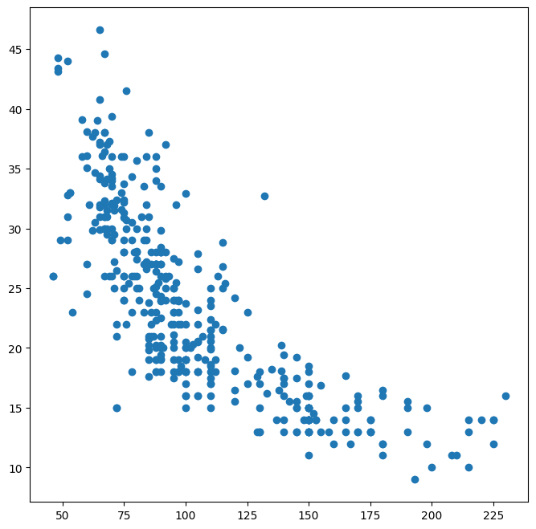
    


```python
ax = Auto.plot.scatter("horsepower", "mpg")
ax.set_title("Horsepower vs. MPG");
```


    
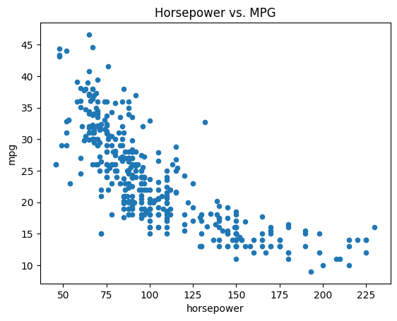
    


```python
fig = ax.figure
fig.savefig("horsepower_mpg.png");
```


```python
Auto.cylinders.dtype
```


    dtype('int64')


```python
Auto.cylinders = pd.Series(Auto.cylinders, dtype="category")
Auto.cylinders.dtype
```


    CategoricalDtype(categories=[3, 4, 5, 6, 8], ordered=False, categories_dtype=int64)


```python
fig, ax = subplots(figsize=(8, 8))
Auto.boxplot("mpg", by="cylinders", ax=ax);
```


    
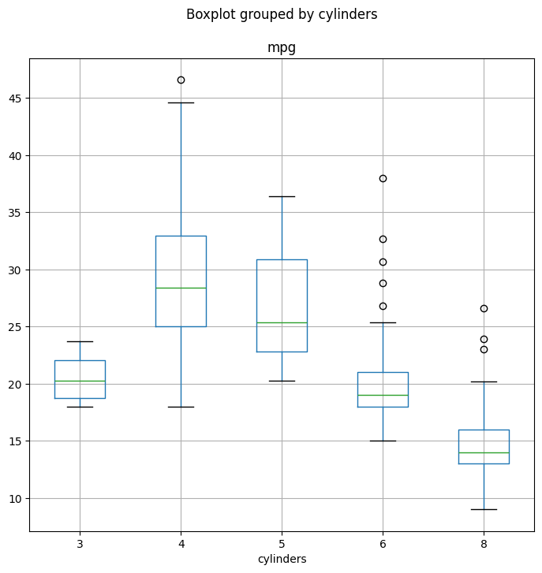
    


```python
fig, ax = subplots(figsize=(8, 8))
Auto.hist("mpg", ax=ax);
```


    
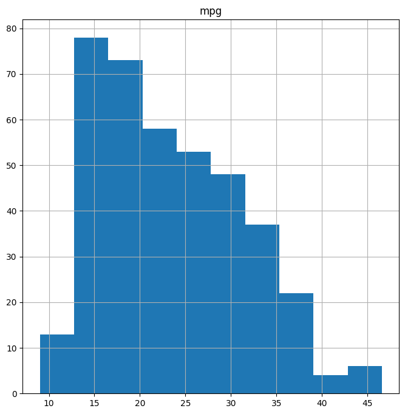
    


```python
fig, ax = subplots(figsize=(8, 8))
Auto.hist("mpg", color="red", bins=12, ax=ax);
```


    
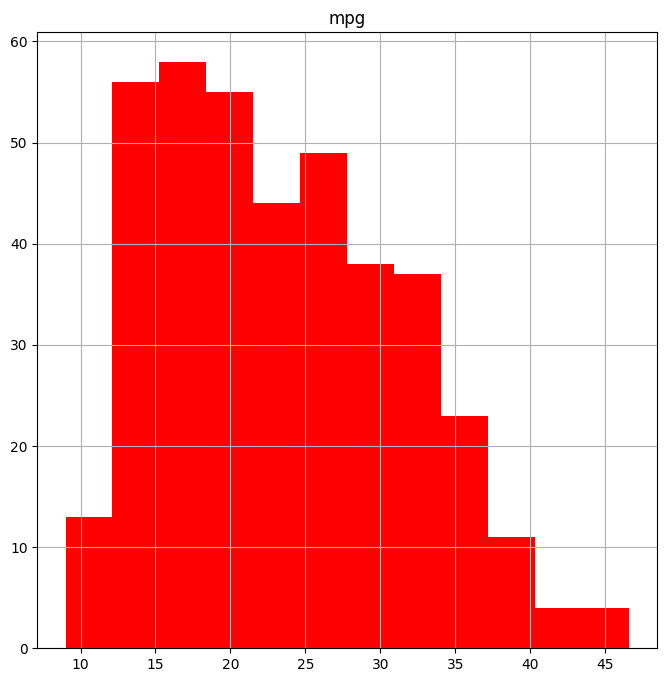
    


```python
pd.plotting.scatter_matrix(Auto, figsize=(15, 15));
```


    
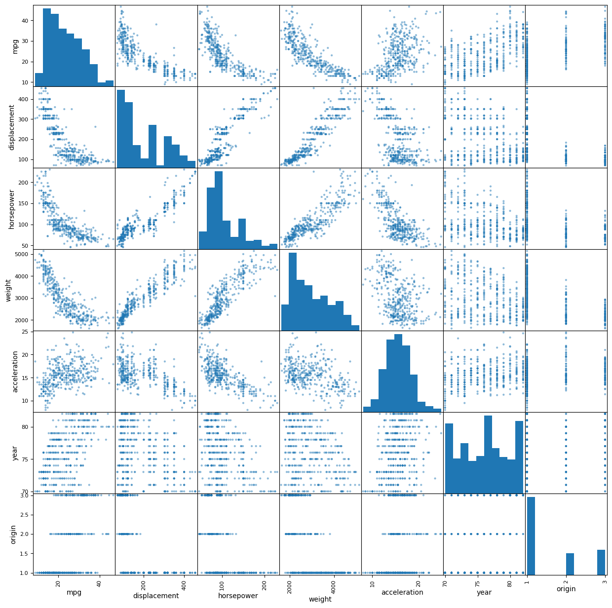
    


```python
pd.plotting.scatter_matrix(Auto[["mpg", "displacement", "weight"]]);
```


    
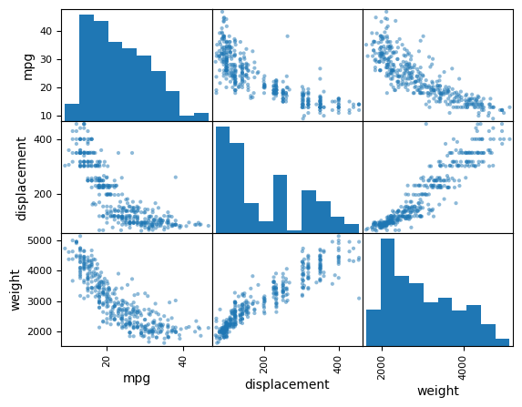
    


```python
Auto[["mpg", "weight"]].describe()
```


<div>
<style scoped>
    .dataframe tbody tr th:only-of-type {
        vertical-align: middle;
    }

    .dataframe tbody tr th {
        vertical-align: top;
    }

    .dataframe thead th {
        text-align: right;
    }
</style>
<table border="1" class="dataframe">
  <thead>
    <tr style="text-align: right;">
      <th></th>
      <th>mpg</th>
      <th>weight</th>
    </tr>
  </thead>
  <tbody>
    <tr>
      <th>count</th>
      <td>392.000000</td>
      <td>392.000000</td>
    </tr>
    <tr>
      <th>mean</th>
      <td>23.445918</td>
      <td>2977.584184</td>
    </tr>
    <tr>
      <th>std</th>
      <td>7.805007</td>
      <td>849.402560</td>
    </tr>
    <tr>
      <th>min</th>
      <td>9.000000</td>
      <td>1613.000000</td>
    </tr>
    <tr>
      <th>25%</th>
      <td>17.000000</td>
      <td>2225.250000</td>
    </tr>
    <tr>
      <th>50%</th>
      <td>22.750000</td>
      <td>2803.500000</td>
    </tr>
    <tr>
      <th>75%</th>
      <td>29.000000</td>
      <td>3614.750000</td>
    </tr>
    <tr>
      <th>max</th>
      <td>46.600000</td>
      <td>5140.000000</td>
    </tr>
  </tbody>
</table>
</div>


```python
Auto["cylinders"].describe()
```


    count     392
    unique      5
    top         4
    freq      199
    Name: cylinders, dtype: int64


```python
Auto["mpg"].describe()
```


    count    392.000000
    mean      23.445918
    std        7.805007
    min        9.000000
    25%       17.000000
    50%       22.750000
    75%       29.000000
    max       46.600000
    Name: mpg, dtype: float64


