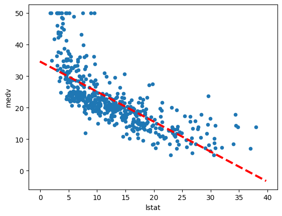
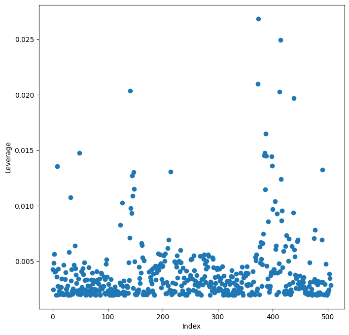
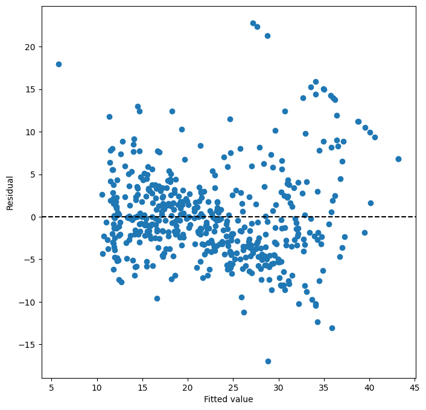

```python
import warnings

warnings.filterwarnings("ignore")
```


```python
import numpy as np
import pandas as pd
import statsmodels.api as sm
from matplotlib.pyplot import subplots
```


```python
from statsmodels.stats.anova import anova_lm
from statsmodels.stats.outliers_influence import variance_inflation_factor as VIF
```


```python
from ISLP import load_data
from ISLP.models import ModelSpec as MS
from ISLP.models import poly, summarize
```


```python
dir()
```


    ['In',
     'MS',
     'Out',
     'VIF',
     '_',
     '__',
     '___',
     '__builtin__',
     '__builtins__',
     '__doc__',
     '__loader__',
     '__name__',
     '__package__',
     '__session__',
     '__spec__',
     '_dh',
     '_i',
     '_i1',
     '_i2',
     '_i3',
     '_i4',
     '_i5',
     '_ih',
     '_ii',
     '_iii',
     '_oh',
     'anova_lm',
     'exit',
     'get_ipython',
     'load_data',
     'np',
     'open',
     'pd',
     'poly',
     'quit',
     'sm',
     'subplots',
     'summarize',
     'warnings']


```python
A = np.array([3, 5, 11])
dir(A)
```


    ['T',
     '__abs__',
     '__add__',
     '__and__',
     '__array__',
     '__array_finalize__',
     '__array_function__',
     '__array_interface__',
     '__array_prepare__',
     '__array_priority__',
     '__array_struct__',
     '__array_ufunc__',
     '__array_wrap__',
     '__bool__',
     '__class__',
     '__class_getitem__',
     '__complex__',
     '__contains__',
     '__copy__',
     '__deepcopy__',
     '__delattr__',
     '__delitem__',
     '__dir__',
     '__divmod__',
     '__dlpack__',
     '__dlpack_device__',
     '__doc__',
     '__eq__',
     '__float__',
     '__floordiv__',
     '__format__',
     '__ge__',
     '__getattribute__',
     '__getitem__',
     '__getstate__',
     '__gt__',
     '__hash__',
     '__iadd__',
     '__iand__',
     '__ifloordiv__',
     '__ilshift__',
     '__imatmul__',
     '__imod__',
     '__imul__',
     '__index__',
     '__init__',
     '__init_subclass__',
     '__int__',
     '__invert__',
     '__ior__',
     '__ipow__',
     '__irshift__',
     '__isub__',
     '__iter__',
     '__itruediv__',
     '__ixor__',
     '__le__',
     '__len__',
     '__lshift__',
     '__lt__',
     '__matmul__',
     '__mod__',
     '__mul__',
     '__ne__',
     '__neg__',
     '__new__',
     '__or__',
     '__pos__',
     '__pow__',
     '__radd__',
     '__rand__',
     '__rdivmod__',
     '__reduce__',
     '__reduce_ex__',
     '__repr__',
     '__rfloordiv__',
     '__rlshift__',
     '__rmatmul__',
     '__rmod__',
     '__rmul__',
     '__ror__',
     '__rpow__',
     '__rrshift__',
     '__rshift__',
     '__rsub__',
     '__rtruediv__',
     '__rxor__',
     '__setattr__',
     '__setitem__',
     '__setstate__',
     '__sizeof__',
     '__str__',
     '__sub__',
     '__subclasshook__',
     '__truediv__',
     '__xor__',
     'all',
     'any',
     'argmax',
     'argmin',
     'argpartition',
     'argsort',
     'astype',
     'base',
     'byteswap',
     'choose',
     'clip',
     'compress',
     'conj',
     'conjugate',
     'copy',
     'ctypes',
     'cumprod',
     'cumsum',
     'data',
     'diagonal',
     'dot',
     'dtype',
     'dump',
     'dumps',
     'fill',
     'flags',
     'flat',
     'flatten',
     'getfield',
     'imag',
     'item',
     'itemset',
     'itemsize',
     'max',
     'mean',
     'min',
     'nbytes',
     'ndim',
     'newbyteorder',
     'nonzero',
     'partition',
     'prod',
     'ptp',
     'put',
     'ravel',
     'real',
     'repeat',
     'reshape',
     'resize',
     'round',
     'searchsorted',
     'setfield',
     'setflags',
     'shape',
     'size',
     'sort',
     'squeeze',
     'std',
     'strides',
     'sum',
     'swapaxes',
     'take',
     'tobytes',
     'tofile',
     'tolist',
     'tostring',
     'trace',
     'transpose',
     'var',
     'view']


```python
A.sum()
```


    19


## Simple Linear Regression


```python
Boston = load_data("Boston")
Boston.columns
```


    Index(['crim', 'zn', 'indus', 'chas', 'nox', 'rm', 'age', 'dis', 'rad', 'tax',
           'ptratio', 'lstat', 'medv'],
          dtype='object')


```python
# Fit a simple linear regression model.
X = pd.DataFrame({"intercept": np.ones(Boston.shape[0]), "lstat": Boston["lstat"]})
X[:4]
```


<div>
<style scoped>
    .dataframe tbody tr th:only-of-type {
        vertical-align: middle;
    }

    .dataframe tbody tr th {
        vertical-align: top;
    }

    .dataframe thead th {
        text-align: right;
    }
</style>
<table border="1" class="dataframe">
  <thead>
    <tr style="text-align: right;">
      <th></th>
      <th>intercept</th>
      <th>lstat</th>
    </tr>
  </thead>
  <tbody>
    <tr>
      <th>0</th>
      <td>1.0</td>
      <td>4.98</td>
    </tr>
    <tr>
      <th>1</th>
      <td>1.0</td>
      <td>9.14</td>
    </tr>
    <tr>
      <th>2</th>
      <td>1.0</td>
      <td>4.03</td>
    </tr>
    <tr>
      <th>3</th>
      <td>1.0</td>
      <td>2.94</td>
    </tr>
  </tbody>
</table>
</div>


```python
y = Boston["medv"]
model = sm.OLS(y, X)
results = model.fit()
```


```python
summarize(results)
```


<div>
<style scoped>
    .dataframe tbody tr th:only-of-type {
        vertical-align: middle;
    }

    .dataframe tbody tr th {
        vertical-align: top;
    }

    .dataframe thead th {
        text-align: right;
    }
</style>
<table border="1" class="dataframe">
  <thead>
    <tr style="text-align: right;">
      <th></th>
      <th>coef</th>
      <th>std err</th>
      <th>t</th>
      <th>P&gt;|t|</th>
    </tr>
  </thead>
  <tbody>
    <tr>
      <th>intercept</th>
      <td>34.5538</td>
      <td>0.563</td>
      <td>61.415</td>
      <td>0.0</td>
    </tr>
    <tr>
      <th>lstat</th>
      <td>-0.9500</td>
      <td>0.039</td>
      <td>-24.528</td>
      <td>0.0</td>
    </tr>
  </tbody>
</table>
</div>


### Using Transformations: Fit and Transform


```python
# import inspect
# print(inspect.getsource(MS))
```


```python
design = MS(["lstat"])
design = design.fit(Boston)
X = design.transform(Boston)
X[:4]
```


<div>
<style scoped>
    .dataframe tbody tr th:only-of-type {
        vertical-align: middle;
    }

    .dataframe tbody tr th {
        vertical-align: top;
    }

    .dataframe thead th {
        text-align: right;
    }
</style>
<table border="1" class="dataframe">
  <thead>
    <tr style="text-align: right;">
      <th></th>
      <th>intercept</th>
      <th>lstat</th>
    </tr>
  </thead>
  <tbody>
    <tr>
      <th>0</th>
      <td>1.0</td>
      <td>4.98</td>
    </tr>
    <tr>
      <th>1</th>
      <td>1.0</td>
      <td>9.14</td>
    </tr>
    <tr>
      <th>2</th>
      <td>1.0</td>
      <td>4.03</td>
    </tr>
    <tr>
      <th>3</th>
      <td>1.0</td>
      <td>2.94</td>
    </tr>
  </tbody>
</table>
</div>


```python
results.summary()
```


<table class="simpletable">
<caption>OLS Regression Results</caption>
<tr>
  <th>Dep. Variable:</th>          <td>medv</td>       <th>  R-squared:         </th> <td>   0.544</td>
</tr>
<tr>
  <th>Model:</th>                   <td>OLS</td>       <th>  Adj. R-squared:    </th> <td>   0.543</td>
</tr>
<tr>
  <th>Method:</th>             <td>Least Squares</td>  <th>  F-statistic:       </th> <td>   601.6</td>
</tr>
<tr>
  <th>Date:</th>             <td>Wed, 10 Apr 2024</td> <th>  Prob (F-statistic):</th> <td>5.08e-88</td>
</tr>
<tr>
  <th>Time:</th>                 <td>16:27:14</td>     <th>  Log-Likelihood:    </th> <td> -1641.5</td>
</tr>
<tr>
  <th>No. Observations:</th>      <td>   506</td>      <th>  AIC:               </th> <td>   3287.</td>
</tr>
<tr>
  <th>Df Residuals:</th>          <td>   504</td>      <th>  BIC:               </th> <td>   3295.</td>
</tr>
<tr>
  <th>Df Model:</th>              <td>     1</td>      <th>                     </th>     <td> </td>   
</tr>
<tr>
  <th>Covariance Type:</th>      <td>nonrobust</td>    <th>                     </th>     <td> </td>   
</tr>
</table>
<table class="simpletable">
<tr>
      <td></td>         <th>coef</th>     <th>std err</th>      <th>t</th>      <th>P>|t|</th>  <th>[0.025</th>    <th>0.975]</th>  
</tr>
<tr>
  <th>intercept</th> <td>   34.5538</td> <td>    0.563</td> <td>   61.415</td> <td> 0.000</td> <td>   33.448</td> <td>   35.659</td>
</tr>
<tr>
  <th>lstat</th>     <td>   -0.9500</td> <td>    0.039</td> <td>  -24.528</td> <td> 0.000</td> <td>   -1.026</td> <td>   -0.874</td>
</tr>
</table>
<table class="simpletable">
<tr>
  <th>Omnibus:</th>       <td>137.043</td> <th>  Durbin-Watson:     </th> <td>   0.892</td>
</tr>
<tr>
  <th>Prob(Omnibus):</th> <td> 0.000</td>  <th>  Jarque-Bera (JB):  </th> <td> 291.373</td>
</tr>
<tr>
  <th>Skew:</th>          <td> 1.453</td>  <th>  Prob(JB):          </th> <td>5.36e-64</td>
</tr>
<tr>
  <th>Kurtosis:</th>      <td> 5.319</td>  <th>  Cond. No.          </th> <td>    29.7</td>
</tr>
</table><br/><br/>Notes:<br/>[1] Standard Errors assume that the covariance matrix of the errors is correctly specified.


```python
results.params
```


    intercept    34.553841
    lstat        -0.950049
    dtype: float64


```python
new_df = pd.DataFrame({"lstat": [5, 10, 15]})
newX = design.transform(new_df)
newX
```


<div>
<style scoped>
    .dataframe tbody tr th:only-of-type {
        vertical-align: middle;
    }

    .dataframe tbody tr th {
        vertical-align: top;
    }

    .dataframe thead th {
        text-align: right;
    }
</style>
<table border="1" class="dataframe">
  <thead>
    <tr style="text-align: right;">
      <th></th>
      <th>intercept</th>
      <th>lstat</th>
    </tr>
  </thead>
  <tbody>
    <tr>
      <th>0</th>
      <td>1.0</td>
      <td>5</td>
    </tr>
    <tr>
      <th>1</th>
      <td>1.0</td>
      <td>10</td>
    </tr>
    <tr>
      <th>2</th>
      <td>1.0</td>
      <td>15</td>
    </tr>
  </tbody>
</table>
</div>


```python
new_predictions = results.get_prediction(newX)
new_predictions.predicted_mean
```


    array([29.80359411, 25.05334734, 20.30310057])


```python
# Produce confidence intervals from the predicted values.
new_predictions.conf_int(alpha=0.05)
```


    array([[29.00741194, 30.59977628],
           [24.47413202, 25.63256267],
           [19.73158815, 20.87461299]])


```python
# Prediction intervals are computing by setting obs=True
new_predictions.conf_int(obs=True, alpha=0.05)
```


    array([[17.56567478, 42.04151344],
           [12.82762635, 37.27906833],
           [ 8.0777421 , 32.52845905]])


### Defining Functions


```python
def abline(ax, b, m, *args, **kwargs):
    """Add a line with slope m and intercept b to ax"""
    xlim = ax.get_xlim()
    ylim = [m * xlim[0] + b, m * xlim[1] + b]
    ax.plot(xlim, ylim, *args, **kwargs)
```


```python
ax = Boston.plot.scatter("lstat", "medv")
abline(ax, results.params[0], results.params[1], "r--", linewidth=3)
```


    

    


```python
ax = subplots(figsize=(8, 8))[1]
ax.scatter(results.fittedvalues, results.resid)
ax.set_xlabel("Fitted value")
ax.set_ylabel("Residual")
ax.axhline(0, c="k", ls="--")
```


```python
infl = results.get_influence()
ax = subplots(figsize=(8, 8))[1]
ax.scatter(np.arange(X.shape[0]), infl.hat_matrix_diag)
ax.set_xlabel("Index")
ax.set_ylabel("Leverage")
np.argmax(infl.hat_matrix_diag)
```


    374


    

    


## Multiple Linear Regression


```python
X = MS(["lstat", "age"]).fit_transform(Boston)
model1 = sm.OLS(y, X)
results1 = model1.fit()
summarize(results1)
```


<div>
<style scoped>
    .dataframe tbody tr th:only-of-type {
        vertical-align: middle;
    }

    .dataframe tbody tr th {
        vertical-align: top;
    }

    .dataframe thead th {
        text-align: right;
    }
</style>
<table border="1" class="dataframe">
  <thead>
    <tr style="text-align: right;">
      <th></th>
      <th>coef</th>
      <th>std err</th>
      <th>t</th>
      <th>P&gt;|t|</th>
    </tr>
  </thead>
  <tbody>
    <tr>
      <th>intercept</th>
      <td>33.2228</td>
      <td>0.731</td>
      <td>45.458</td>
      <td>0.000</td>
    </tr>
    <tr>
      <th>lstat</th>
      <td>-1.0321</td>
      <td>0.048</td>
      <td>-21.416</td>
      <td>0.000</td>
    </tr>
    <tr>
      <th>age</th>
      <td>0.0345</td>
      <td>0.012</td>
      <td>2.826</td>
      <td>0.005</td>
    </tr>
  </tbody>
</table>
</div>


```python
terms = Boston.columns.drop("medv")
terms
```


    Index(['crim', 'zn', 'indus', 'chas', 'nox', 'rm', 'age', 'dis', 'rad', 'tax',
           'ptratio', 'lstat'],
          dtype='object')


```python
X = MS(terms).fit_transform(Boston)
model = sm.OLS(y, X)
results = model.fit()
summarize(results)
```


<div>
<style scoped>
    .dataframe tbody tr th:only-of-type {
        vertical-align: middle;
    }

    .dataframe tbody tr th {
        vertical-align: top;
    }

    .dataframe thead th {
        text-align: right;
    }
</style>
<table border="1" class="dataframe">
  <thead>
    <tr style="text-align: right;">
      <th></th>
      <th>coef</th>
      <th>std err</th>
      <th>t</th>
      <th>P&gt;|t|</th>
    </tr>
  </thead>
  <tbody>
    <tr>
      <th>intercept</th>
      <td>41.6173</td>
      <td>4.936</td>
      <td>8.431</td>
      <td>0.000</td>
    </tr>
    <tr>
      <th>crim</th>
      <td>-0.1214</td>
      <td>0.033</td>
      <td>-3.678</td>
      <td>0.000</td>
    </tr>
    <tr>
      <th>zn</th>
      <td>0.0470</td>
      <td>0.014</td>
      <td>3.384</td>
      <td>0.001</td>
    </tr>
    <tr>
      <th>indus</th>
      <td>0.0135</td>
      <td>0.062</td>
      <td>0.217</td>
      <td>0.829</td>
    </tr>
    <tr>
      <th>chas</th>
      <td>2.8400</td>
      <td>0.870</td>
      <td>3.264</td>
      <td>0.001</td>
    </tr>
    <tr>
      <th>nox</th>
      <td>-18.7580</td>
      <td>3.851</td>
      <td>-4.870</td>
      <td>0.000</td>
    </tr>
    <tr>
      <th>rm</th>
      <td>3.6581</td>
      <td>0.420</td>
      <td>8.705</td>
      <td>0.000</td>
    </tr>
    <tr>
      <th>age</th>
      <td>0.0036</td>
      <td>0.013</td>
      <td>0.271</td>
      <td>0.787</td>
    </tr>
    <tr>
      <th>dis</th>
      <td>-1.4908</td>
      <td>0.202</td>
      <td>-7.394</td>
      <td>0.000</td>
    </tr>
    <tr>
      <th>rad</th>
      <td>0.2894</td>
      <td>0.067</td>
      <td>4.325</td>
      <td>0.000</td>
    </tr>
    <tr>
      <th>tax</th>
      <td>-0.0127</td>
      <td>0.004</td>
      <td>-3.337</td>
      <td>0.001</td>
    </tr>
    <tr>
      <th>ptratio</th>
      <td>-0.9375</td>
      <td>0.132</td>
      <td>-7.091</td>
      <td>0.000</td>
    </tr>
    <tr>
      <th>lstat</th>
      <td>-0.5520</td>
      <td>0.051</td>
      <td>-10.897</td>
      <td>0.000</td>
    </tr>
  </tbody>
</table>
</div>


```python
minus_age = Boston.columns.drop(["medv", "age"])
Xma = MS(minus_age).fit_transform(Boston)
model1 = sm.OLS(y, Xma)
summarize(model1.fit())
```


<div>
<style scoped>
    .dataframe tbody tr th:only-of-type {
        vertical-align: middle;
    }

    .dataframe tbody tr th {
        vertical-align: top;
    }

    .dataframe thead th {
        text-align: right;
    }
</style>
<table border="1" class="dataframe">
  <thead>
    <tr style="text-align: right;">
      <th></th>
      <th>coef</th>
      <th>std err</th>
      <th>t</th>
      <th>P&gt;|t|</th>
    </tr>
  </thead>
  <tbody>
    <tr>
      <th>intercept</th>
      <td>41.5251</td>
      <td>4.920</td>
      <td>8.441</td>
      <td>0.000</td>
    </tr>
    <tr>
      <th>crim</th>
      <td>-0.1214</td>
      <td>0.033</td>
      <td>-3.683</td>
      <td>0.000</td>
    </tr>
    <tr>
      <th>zn</th>
      <td>0.0465</td>
      <td>0.014</td>
      <td>3.379</td>
      <td>0.001</td>
    </tr>
    <tr>
      <th>indus</th>
      <td>0.0135</td>
      <td>0.062</td>
      <td>0.217</td>
      <td>0.829</td>
    </tr>
    <tr>
      <th>chas</th>
      <td>2.8528</td>
      <td>0.868</td>
      <td>3.287</td>
      <td>0.001</td>
    </tr>
    <tr>
      <th>nox</th>
      <td>-18.4851</td>
      <td>3.714</td>
      <td>-4.978</td>
      <td>0.000</td>
    </tr>
    <tr>
      <th>rm</th>
      <td>3.6811</td>
      <td>0.411</td>
      <td>8.951</td>
      <td>0.000</td>
    </tr>
    <tr>
      <th>dis</th>
      <td>-1.5068</td>
      <td>0.193</td>
      <td>-7.825</td>
      <td>0.000</td>
    </tr>
    <tr>
      <th>rad</th>
      <td>0.2879</td>
      <td>0.067</td>
      <td>4.322</td>
      <td>0.000</td>
    </tr>
    <tr>
      <th>tax</th>
      <td>-0.0127</td>
      <td>0.004</td>
      <td>-3.333</td>
      <td>0.001</td>
    </tr>
    <tr>
      <th>ptratio</th>
      <td>-0.9346</td>
      <td>0.132</td>
      <td>-7.099</td>
      <td>0.000</td>
    </tr>
    <tr>
      <th>lstat</th>
      <td>-0.5474</td>
      <td>0.048</td>
      <td>-11.483</td>
      <td>0.000</td>
    </tr>
  </tbody>
</table>
</div>


## Mulitvariante Goodness of Fit


```python
vals = [VIF(X, i) for i in range(1, X.shape[1])]
vif = pd.DataFrame({"vif": vals}, index=X.columns[1:])
vif
```


<div>
<style scoped>
    .dataframe tbody tr th:only-of-type {
        vertical-align: middle;
    }

    .dataframe tbody tr th {
        vertical-align: top;
    }

    .dataframe thead th {
        text-align: right;
    }
</style>
<table border="1" class="dataframe">
  <thead>
    <tr style="text-align: right;">
      <th></th>
      <th>vif</th>
    </tr>
  </thead>
  <tbody>
    <tr>
      <th>crim</th>
      <td>1.767486</td>
    </tr>
    <tr>
      <th>zn</th>
      <td>2.298459</td>
    </tr>
    <tr>
      <th>indus</th>
      <td>3.987181</td>
    </tr>
    <tr>
      <th>chas</th>
      <td>1.071168</td>
    </tr>
    <tr>
      <th>nox</th>
      <td>4.369093</td>
    </tr>
    <tr>
      <th>rm</th>
      <td>1.912532</td>
    </tr>
    <tr>
      <th>age</th>
      <td>3.088232</td>
    </tr>
    <tr>
      <th>dis</th>
      <td>3.954037</td>
    </tr>
    <tr>
      <th>rad</th>
      <td>7.445301</td>
    </tr>
    <tr>
      <th>tax</th>
      <td>9.002158</td>
    </tr>
    <tr>
      <th>ptratio</th>
      <td>1.797060</td>
    </tr>
    <tr>
      <th>lstat</th>
      <td>2.870777</td>
    </tr>
  </tbody>
</table>
</div>


## Interaction Terms


```python
X = MS(["lstat", "age", ("lstat", "age")]).fit_transform(Boston)
model2 = sm.OLS(y, X)
summarize(model2.fit())
```


<div>
<style scoped>
    .dataframe tbody tr th:only-of-type {
        vertical-align: middle;
    }

    .dataframe tbody tr th {
        vertical-align: top;
    }

    .dataframe thead th {
        text-align: right;
    }
</style>
<table border="1" class="dataframe">
  <thead>
    <tr style="text-align: right;">
      <th></th>
      <th>coef</th>
      <th>std err</th>
      <th>t</th>
      <th>P&gt;|t|</th>
    </tr>
  </thead>
  <tbody>
    <tr>
      <th>intercept</th>
      <td>36.0885</td>
      <td>1.470</td>
      <td>24.553</td>
      <td>0.000</td>
    </tr>
    <tr>
      <th>lstat</th>
      <td>-1.3921</td>
      <td>0.167</td>
      <td>-8.313</td>
      <td>0.000</td>
    </tr>
    <tr>
      <th>age</th>
      <td>-0.0007</td>
      <td>0.020</td>
      <td>-0.036</td>
      <td>0.971</td>
    </tr>
    <tr>
      <th>lstat:age</th>
      <td>0.0042</td>
      <td>0.002</td>
      <td>2.244</td>
      <td>0.025</td>
    </tr>
  </tbody>
</table>
</div>


## Non-linear Transformations of the Predictors


```python
X = MS([poly("lstat", degree=2), "age"]).fit_transform(Boston)
model3 = sm.OLS(y, X)
results3 = model3.fit()
summarize(results3)
```


<div>
<style scoped>
    .dataframe tbody tr th:only-of-type {
        vertical-align: middle;
    }

    .dataframe tbody tr th {
        vertical-align: top;
    }

    .dataframe thead th {
        text-align: right;
    }
</style>
<table border="1" class="dataframe">
  <thead>
    <tr style="text-align: right;">
      <th></th>
      <th>coef</th>
      <th>std err</th>
      <th>t</th>
      <th>P&gt;|t|</th>
    </tr>
  </thead>
  <tbody>
    <tr>
      <th>intercept</th>
      <td>17.7151</td>
      <td>0.781</td>
      <td>22.681</td>
      <td>0.0</td>
    </tr>
    <tr>
      <th>poly(lstat, degree=2)[0]</th>
      <td>-179.2279</td>
      <td>6.733</td>
      <td>-26.620</td>
      <td>0.0</td>
    </tr>
    <tr>
      <th>poly(lstat, degree=2)[1]</th>
      <td>72.9908</td>
      <td>5.482</td>
      <td>13.315</td>
      <td>0.0</td>
    </tr>
    <tr>
      <th>age</th>
      <td>0.0703</td>
      <td>0.011</td>
      <td>6.471</td>
      <td>0.0</td>
    </tr>
  </tbody>
</table>
</div>


```python
anova_lm(results1, results3)
```


<div>
<style scoped>
    .dataframe tbody tr th:only-of-type {
        vertical-align: middle;
    }

    .dataframe tbody tr th {
        vertical-align: top;
    }

    .dataframe thead th {
        text-align: right;
    }
</style>
<table border="1" class="dataframe">
  <thead>
    <tr style="text-align: right;">
      <th></th>
      <th>df_resid</th>
      <th>ssr</th>
      <th>df_diff</th>
      <th>ss_diff</th>
      <th>F</th>
      <th>Pr(&gt;F)</th>
    </tr>
  </thead>
  <tbody>
    <tr>
      <th>0</th>
      <td>503.0</td>
      <td>19168.128609</td>
      <td>0.0</td>
      <td>NaN</td>
      <td>NaN</td>
      <td>NaN</td>
    </tr>
    <tr>
      <th>1</th>
      <td>502.0</td>
      <td>14165.613251</td>
      <td>1.0</td>
      <td>5002.515357</td>
      <td>177.278785</td>
      <td>7.468491e-35</td>
    </tr>
  </tbody>
</table>
</div>


```python
ax = subplots(figsize=(8, 8))[1]
ax.scatter(results3.fittedvalues, results3.resid)
ax.set_xlabel("Fitted value")
ax.set_ylabel("Residual")
ax.axhline(0, c="k", ls="--");
```


    

    


## Qualitative Predictors


```python
Carseats = load_data("Carseats")
Carseats.columns
```


    Index(['Sales', 'CompPrice', 'Income', 'Advertising', 'Population', 'Price',
           'ShelveLoc', 'Age', 'Education', 'Urban', 'US'],
          dtype='object')


```python
allvars = list(Carseats.columns.drop("Sales"))
y = Carseats["Sales"]
final = allvars + [("Income", "Advertising"), ("Price", "Age")]
X = MS(final).fit_transform(Carseats)
model = sm.OLS(y, X)
summarize(model.fit())
```


<div>
<style scoped>
    .dataframe tbody tr th:only-of-type {
        vertical-align: middle;
    }

    .dataframe tbody tr th {
        vertical-align: top;
    }

    .dataframe thead th {
        text-align: right;
    }
</style>
<table border="1" class="dataframe">
  <thead>
    <tr style="text-align: right;">
      <th></th>
      <th>coef</th>
      <th>std err</th>
      <th>t</th>
      <th>P&gt;|t|</th>
    </tr>
  </thead>
  <tbody>
    <tr>
      <th>intercept</th>
      <td>6.5756</td>
      <td>1.009</td>
      <td>6.519</td>
      <td>0.000</td>
    </tr>
    <tr>
      <th>CompPrice</th>
      <td>0.0929</td>
      <td>0.004</td>
      <td>22.567</td>
      <td>0.000</td>
    </tr>
    <tr>
      <th>Income</th>
      <td>0.0109</td>
      <td>0.003</td>
      <td>4.183</td>
      <td>0.000</td>
    </tr>
    <tr>
      <th>Advertising</th>
      <td>0.0702</td>
      <td>0.023</td>
      <td>3.107</td>
      <td>0.002</td>
    </tr>
    <tr>
      <th>Population</th>
      <td>0.0002</td>
      <td>0.000</td>
      <td>0.433</td>
      <td>0.665</td>
    </tr>
    <tr>
      <th>Price</th>
      <td>-0.1008</td>
      <td>0.007</td>
      <td>-13.549</td>
      <td>0.000</td>
    </tr>
    <tr>
      <th>ShelveLoc[Good]</th>
      <td>4.8487</td>
      <td>0.153</td>
      <td>31.724</td>
      <td>0.000</td>
    </tr>
    <tr>
      <th>ShelveLoc[Medium]</th>
      <td>1.9533</td>
      <td>0.126</td>
      <td>15.531</td>
      <td>0.000</td>
    </tr>
    <tr>
      <th>Age</th>
      <td>-0.0579</td>
      <td>0.016</td>
      <td>-3.633</td>
      <td>0.000</td>
    </tr>
    <tr>
      <th>Education</th>
      <td>-0.0209</td>
      <td>0.020</td>
      <td>-1.063</td>
      <td>0.288</td>
    </tr>
    <tr>
      <th>Urban[Yes]</th>
      <td>0.1402</td>
      <td>0.112</td>
      <td>1.247</td>
      <td>0.213</td>
    </tr>
    <tr>
      <th>US[Yes]</th>
      <td>-0.1576</td>
      <td>0.149</td>
      <td>-1.058</td>
      <td>0.291</td>
    </tr>
    <tr>
      <th>Income:Advertising</th>
      <td>0.0008</td>
      <td>0.000</td>
      <td>2.698</td>
      <td>0.007</td>
    </tr>
    <tr>
      <th>Price:Age</th>
      <td>0.0001</td>
      <td>0.000</td>
      <td>0.801</td>
      <td>0.424</td>
    </tr>
  </tbody>
</table>
</div>


