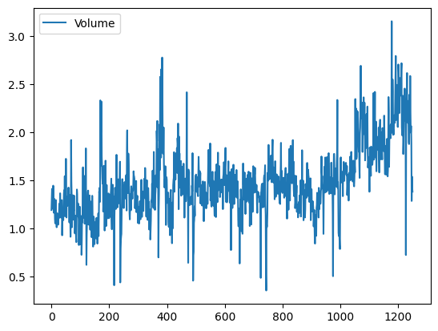
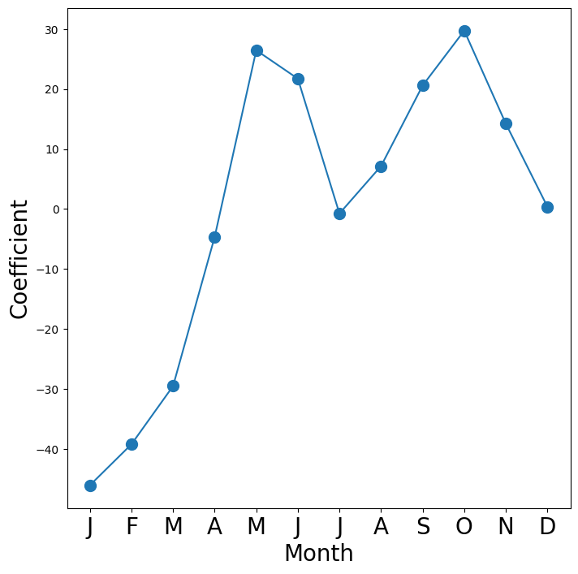
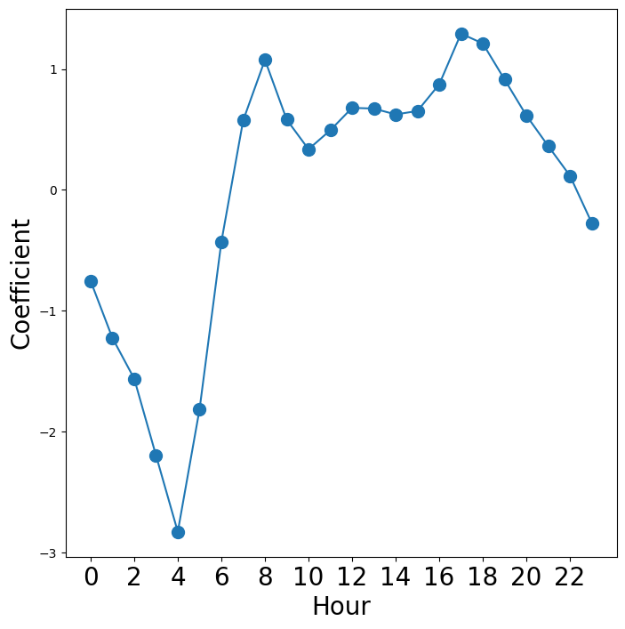
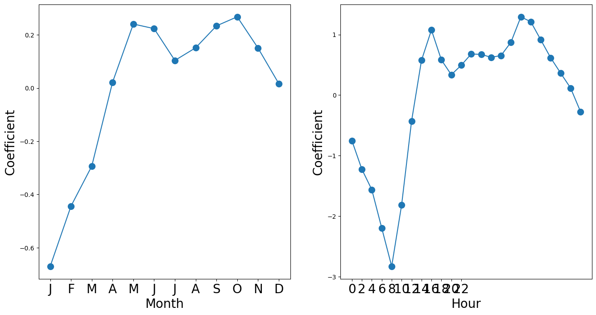
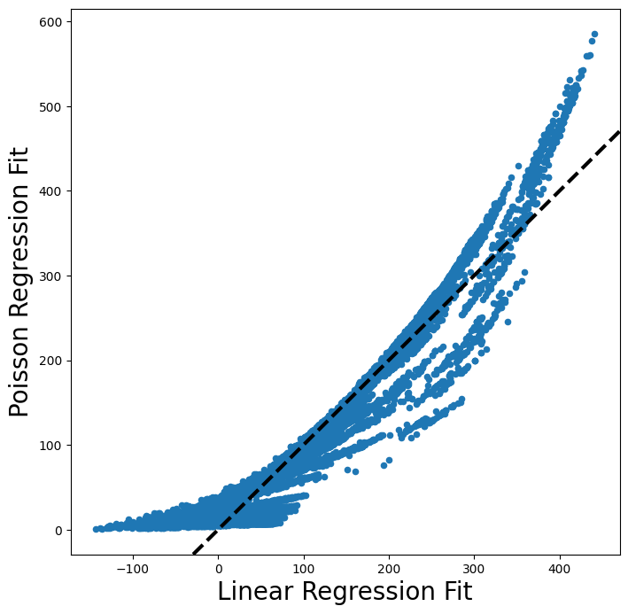

# Lab: Logistic Regression, LDA, QDA and KNN


```python
import numpy as np
import pandas as pd
import statsmodels.api as sm
from ISLP import confusion_table, load_data
from ISLP.models import ModelSpec as MS
from ISLP.models import contrast, summarize
from matplotlib.pyplot import subplots
from sklearn.discriminant_analysis import LinearDiscriminantAnalysis as LDA
from sklearn.discriminant_analysis import QuadraticDiscriminantAnalysis as QDA
from sklearn.linear_model import LogisticRegression
from sklearn.model_selection import train_test_split
from sklearn.naive_bayes import GaussianNB
from sklearn.neighbors import KNeighborsClassifier
from sklearn.preprocessing import StandardScaler
```

## The Stock Market Data


```python
Smarket = load_data("Smarket")
Smarket
```


<div>
<style scoped>
    .dataframe tbody tr th:only-of-type {
        vertical-align: middle;
    }

    .dataframe tbody tr th {
        vertical-align: top;
    }

    .dataframe thead th {
        text-align: right;
    }
</style>
<table border="1" class="dataframe">
  <thead>
    <tr style="text-align: right;">
      <th></th>
      <th>Year</th>
      <th>Lag1</th>
      <th>Lag2</th>
      <th>Lag3</th>
      <th>Lag4</th>
      <th>Lag5</th>
      <th>Volume</th>
      <th>Today</th>
      <th>Direction</th>
    </tr>
  </thead>
  <tbody>
    <tr>
      <th>0</th>
      <td>2001</td>
      <td>0.381</td>
      <td>-0.192</td>
      <td>-2.624</td>
      <td>-1.055</td>
      <td>5.010</td>
      <td>1.19130</td>
      <td>0.959</td>
      <td>Up</td>
    </tr>
    <tr>
      <th>1</th>
      <td>2001</td>
      <td>0.959</td>
      <td>0.381</td>
      <td>-0.192</td>
      <td>-2.624</td>
      <td>-1.055</td>
      <td>1.29650</td>
      <td>1.032</td>
      <td>Up</td>
    </tr>
    <tr>
      <th>2</th>
      <td>2001</td>
      <td>1.032</td>
      <td>0.959</td>
      <td>0.381</td>
      <td>-0.192</td>
      <td>-2.624</td>
      <td>1.41120</td>
      <td>-0.623</td>
      <td>Down</td>
    </tr>
    <tr>
      <th>3</th>
      <td>2001</td>
      <td>-0.623</td>
      <td>1.032</td>
      <td>0.959</td>
      <td>0.381</td>
      <td>-0.192</td>
      <td>1.27600</td>
      <td>0.614</td>
      <td>Up</td>
    </tr>
    <tr>
      <th>4</th>
      <td>2001</td>
      <td>0.614</td>
      <td>-0.623</td>
      <td>1.032</td>
      <td>0.959</td>
      <td>0.381</td>
      <td>1.20570</td>
      <td>0.213</td>
      <td>Up</td>
    </tr>
    <tr>
      <th>...</th>
      <td>...</td>
      <td>...</td>
      <td>...</td>
      <td>...</td>
      <td>...</td>
      <td>...</td>
      <td>...</td>
      <td>...</td>
      <td>...</td>
    </tr>
    <tr>
      <th>1245</th>
      <td>2005</td>
      <td>0.422</td>
      <td>0.252</td>
      <td>-0.024</td>
      <td>-0.584</td>
      <td>-0.285</td>
      <td>1.88850</td>
      <td>0.043</td>
      <td>Up</td>
    </tr>
    <tr>
      <th>1246</th>
      <td>2005</td>
      <td>0.043</td>
      <td>0.422</td>
      <td>0.252</td>
      <td>-0.024</td>
      <td>-0.584</td>
      <td>1.28581</td>
      <td>-0.955</td>
      <td>Down</td>
    </tr>
    <tr>
      <th>1247</th>
      <td>2005</td>
      <td>-0.955</td>
      <td>0.043</td>
      <td>0.422</td>
      <td>0.252</td>
      <td>-0.024</td>
      <td>1.54047</td>
      <td>0.130</td>
      <td>Up</td>
    </tr>
    <tr>
      <th>1248</th>
      <td>2005</td>
      <td>0.130</td>
      <td>-0.955</td>
      <td>0.043</td>
      <td>0.422</td>
      <td>0.252</td>
      <td>1.42236</td>
      <td>-0.298</td>
      <td>Down</td>
    </tr>
    <tr>
      <th>1249</th>
      <td>2005</td>
      <td>-0.298</td>
      <td>0.130</td>
      <td>-0.955</td>
      <td>0.043</td>
      <td>0.422</td>
      <td>1.38254</td>
      <td>-0.489</td>
      <td>Down</td>
    </tr>
  </tbody>
</table>
<p>1250 rows × 9 columns</p>
</div>


```python
Smarket.columns
```


    Index(['Year', 'Lag1', 'Lag2', 'Lag3', 'Lag4', 'Lag5', 'Volume', 'Today',
           'Direction'],
          dtype='object')


```python
Smarket.corr()
```

    /var/folders/7m/74_ct3hx33d878n626w1wxyc0000gn/T/ipykernel_93064/1907124636.py:1: FutureWarning: The default value of numeric_only in DataFrame.corr is deprecated. In a future version, it will default to False. Select only valid columns or specify the value of numeric_only to silence this warning.
      Smarket.corr()


<div>
<style scoped>
    .dataframe tbody tr th:only-of-type {
        vertical-align: middle;
    }

    .dataframe tbody tr th {
        vertical-align: top;
    }

    .dataframe thead th {
        text-align: right;
    }
</style>
<table border="1" class="dataframe">
  <thead>
    <tr style="text-align: right;">
      <th></th>
      <th>Year</th>
      <th>Lag1</th>
      <th>Lag2</th>
      <th>Lag3</th>
      <th>Lag4</th>
      <th>Lag5</th>
      <th>Volume</th>
      <th>Today</th>
    </tr>
  </thead>
  <tbody>
    <tr>
      <th>Year</th>
      <td>1.000000</td>
      <td>0.029700</td>
      <td>0.030596</td>
      <td>0.033195</td>
      <td>0.035689</td>
      <td>0.029788</td>
      <td>0.539006</td>
      <td>0.030095</td>
    </tr>
    <tr>
      <th>Lag1</th>
      <td>0.029700</td>
      <td>1.000000</td>
      <td>-0.026294</td>
      <td>-0.010803</td>
      <td>-0.002986</td>
      <td>-0.005675</td>
      <td>0.040910</td>
      <td>-0.026155</td>
    </tr>
    <tr>
      <th>Lag2</th>
      <td>0.030596</td>
      <td>-0.026294</td>
      <td>1.000000</td>
      <td>-0.025897</td>
      <td>-0.010854</td>
      <td>-0.003558</td>
      <td>-0.043383</td>
      <td>-0.010250</td>
    </tr>
    <tr>
      <th>Lag3</th>
      <td>0.033195</td>
      <td>-0.010803</td>
      <td>-0.025897</td>
      <td>1.000000</td>
      <td>-0.024051</td>
      <td>-0.018808</td>
      <td>-0.041824</td>
      <td>-0.002448</td>
    </tr>
    <tr>
      <th>Lag4</th>
      <td>0.035689</td>
      <td>-0.002986</td>
      <td>-0.010854</td>
      <td>-0.024051</td>
      <td>1.000000</td>
      <td>-0.027084</td>
      <td>-0.048414</td>
      <td>-0.006900</td>
    </tr>
    <tr>
      <th>Lag5</th>
      <td>0.029788</td>
      <td>-0.005675</td>
      <td>-0.003558</td>
      <td>-0.018808</td>
      <td>-0.027084</td>
      <td>1.000000</td>
      <td>-0.022002</td>
      <td>-0.034860</td>
    </tr>
    <tr>
      <th>Volume</th>
      <td>0.539006</td>
      <td>0.040910</td>
      <td>-0.043383</td>
      <td>-0.041824</td>
      <td>-0.048414</td>
      <td>-0.022002</td>
      <td>1.000000</td>
      <td>0.014592</td>
    </tr>
    <tr>
      <th>Today</th>
      <td>0.030095</td>
      <td>-0.026155</td>
      <td>-0.010250</td>
      <td>-0.002448</td>
      <td>-0.006900</td>
      <td>-0.034860</td>
      <td>0.014592</td>
      <td>1.000000</td>
    </tr>
  </tbody>
</table>
</div>


```python
Smarket.plot(y="Volume")
```


    <Axes: >


    

    


## Logistic Regression


```python
allvars = Smarket.columns.drop(["Today", "Direction", "Year"])
design = MS(allvars)
X = design.fit_transform(Smarket)
y = Smarket.Direction == "Up"

# GLM function fits generalized linear model.
# We need to tell it to use the `family` in order to tell the model to use logistic regression.
glm = sm.GLM(y, X, family=sm.families.Binomial())
results = glm.fit()
summarize(results)
```


<div>
<style scoped>
    .dataframe tbody tr th:only-of-type {
        vertical-align: middle;
    }

    .dataframe tbody tr th {
        vertical-align: top;
    }

    .dataframe thead th {
        text-align: right;
    }
</style>
<table border="1" class="dataframe">
  <thead>
    <tr style="text-align: right;">
      <th></th>
      <th>coef</th>
      <th>std err</th>
      <th>z</th>
      <th>P&gt;|z|</th>
    </tr>
  </thead>
  <tbody>
    <tr>
      <th>intercept</th>
      <td>-0.1260</td>
      <td>0.241</td>
      <td>-0.523</td>
      <td>0.601</td>
    </tr>
    <tr>
      <th>Lag1</th>
      <td>-0.0731</td>
      <td>0.050</td>
      <td>-1.457</td>
      <td>0.145</td>
    </tr>
    <tr>
      <th>Lag2</th>
      <td>-0.0423</td>
      <td>0.050</td>
      <td>-0.845</td>
      <td>0.398</td>
    </tr>
    <tr>
      <th>Lag3</th>
      <td>0.0111</td>
      <td>0.050</td>
      <td>0.222</td>
      <td>0.824</td>
    </tr>
    <tr>
      <th>Lag4</th>
      <td>0.0094</td>
      <td>0.050</td>
      <td>0.187</td>
      <td>0.851</td>
    </tr>
    <tr>
      <th>Lag5</th>
      <td>0.0103</td>
      <td>0.050</td>
      <td>0.208</td>
      <td>0.835</td>
    </tr>
    <tr>
      <th>Volume</th>
      <td>0.1354</td>
      <td>0.158</td>
      <td>0.855</td>
      <td>0.392</td>
    </tr>
  </tbody>
</table>
</div>


```python
results.params
```


    intercept   -0.126000
    Lag1        -0.073074
    Lag2        -0.042301
    Lag3         0.011085
    Lag4         0.009359
    Lag5         0.010313
    Volume       0.135441
    dtype: float64


```python
results.pvalues
```


    intercept    0.600700
    Lag1         0.145232
    Lag2         0.398352
    Lag3         0.824334
    Lag4         0.851445
    Lag5         0.834998
    Volume       0.392404
    dtype: float64


The `predict()` method of `results` can be used to predict the probability that the market will go up, given values of the predictors.

If no data is provided to the `predict()` function, then the probabilities are computed for the training data that was used to fit the logistic regression model.


```python
probs = results.predict()
probs[:10]
```


    array([0.50708413, 0.48146788, 0.48113883, 0.51522236, 0.51078116,
           0.50695646, 0.49265087, 0.50922916, 0.51761353, 0.48883778])


```python
labels = np.array(["Down"] * 1250)
labels[probs > 0.5] = "Up"
labels
```


    array(['Up', 'Down', 'Down', ..., 'Up', 'Up', 'Up'], dtype='<U4')


```python
confusion_table(labels, Smarket.Direction)
```


<div>
<style scoped>
    .dataframe tbody tr th:only-of-type {
        vertical-align: middle;
    }

    .dataframe tbody tr th {
        vertical-align: top;
    }

    .dataframe thead th {
        text-align: right;
    }
</style>
<table border="1" class="dataframe">
  <thead>
    <tr style="text-align: right;">
      <th>Truth</th>
      <th>Down</th>
      <th>Up</th>
    </tr>
    <tr>
      <th>Predicted</th>
      <th></th>
      <th></th>
    </tr>
  </thead>
  <tbody>
    <tr>
      <th>Down</th>
      <td>145</td>
      <td>141</td>
    </tr>
    <tr>
      <th>Up</th>
      <td>457</td>
      <td>507</td>
    </tr>
  </tbody>
</table>
</div>


```python
(507 + 145) / 1250, np.mean(labels == Smarket.Direction)
```


    (0.5216, 0.5216)


```python
train = Smarket.Year < 2005
Smarket_train = Smarket.loc[train]
Smarket_test = Smarket.loc[~train]
Smarket_test.shape
```


    (252, 9)


```python
X_train, X_test = X.loc[train], X.loc[~train]
y_train, y_test = y.loc[train], y.loc[~train]
glm_train = sm.GLM(y_train, X_train, family=sm.families.Binomial())
results = glm_train.fit()
probs = results.predict(exog=X_test)
```


```python
D = Smarket.Direction
L_train, L_test = D.loc[train], D.loc[~train]
```


```python
labels = np.array(["Down"] * 252)
labels[probs > 0.5] = "Up"
confusion_table(labels, L_test)
```


<div>
<style scoped>
    .dataframe tbody tr th:only-of-type {
        vertical-align: middle;
    }

    .dataframe tbody tr th {
        vertical-align: top;
    }

    .dataframe thead th {
        text-align: right;
    }
</style>
<table border="1" class="dataframe">
  <thead>
    <tr style="text-align: right;">
      <th>Truth</th>
      <th>Down</th>
      <th>Up</th>
    </tr>
    <tr>
      <th>Predicted</th>
      <th></th>
      <th></th>
    </tr>
  </thead>
  <tbody>
    <tr>
      <th>Down</th>
      <td>77</td>
      <td>97</td>
    </tr>
    <tr>
      <th>Up</th>
      <td>34</td>
      <td>44</td>
    </tr>
  </tbody>
</table>
</div>


```python
np.mean(labels == L_test), np.mean(labels != L_test)
```


    (0.4801587301587302, 0.5198412698412699)


```python
model = MS(["Lag1", "Lag2"]).fit(Smarket)
X = model.transform(Smarket)
X_train, X_test = X.loc[train], X.loc[~train]
glm_train = sm.GLM(y_train, X_train, family=sm.families.Binomial())

results = glm_train.fit()
probs = results.predict(exog=X_test)

labels = np.array(["Down"] * 252)
labels[probs > 0.5] = "Up"

confusion_table(labels, L_test)
```


<div>
<style scoped>
    .dataframe tbody tr th:only-of-type {
        vertical-align: middle;
    }

    .dataframe tbody tr th {
        vertical-align: top;
    }

    .dataframe thead th {
        text-align: right;
    }
</style>
<table border="1" class="dataframe">
  <thead>
    <tr style="text-align: right;">
      <th>Truth</th>
      <th>Down</th>
      <th>Up</th>
    </tr>
    <tr>
      <th>Predicted</th>
      <th></th>
      <th></th>
    </tr>
  </thead>
  <tbody>
    <tr>
      <th>Down</th>
      <td>35</td>
      <td>35</td>
    </tr>
    <tr>
      <th>Up</th>
      <td>76</td>
      <td>106</td>
    </tr>
  </tbody>
</table>
</div>


```python
(35 + 106) / 252, 106 / (106 + 76)
```


    (0.5595238095238095, 0.5824175824175825)


```python
newdata = pd.DataFrame(
    {
        "Lag1": [1.2, 1.5],
        "Lag2": [1.1, -0.8],
    }
)
newX = model.transform(newdata)
results.predict(newX)
```


    0    0.479146
    1    0.496094
    dtype: float64


## Linear Discriminant Analysis


```python
lda = LDA(store_covariance=True)
```


```python
X_train, X_test = [M.drop(columns=["intercept"]) for M in [X_train, X_test]]
lda.fit(X_train, L_train)
```


<style>#sk-container-id-5 {
  /* Definition of color scheme common for light and dark mode */
  --sklearn-color-text: black;
  --sklearn-color-line: gray;
  /* Definition of color scheme for unfitted estimators */
  --sklearn-color-unfitted-level-0: #fff5e6;
  --sklearn-color-unfitted-level-1: #f6e4d2;
  --sklearn-color-unfitted-level-2: #ffe0b3;
  --sklearn-color-unfitted-level-3: chocolate;
  /* Definition of color scheme for fitted estimators */
  --sklearn-color-fitted-level-0: #f0f8ff;
  --sklearn-color-fitted-level-1: #d4ebff;
  --sklearn-color-fitted-level-2: #b3dbfd;
  --sklearn-color-fitted-level-3: cornflowerblue;

  /* Specific color for light theme */
  --sklearn-color-text-on-default-background: var(--sg-text-color, var(--theme-code-foreground, var(--jp-content-font-color1, black)));
  --sklearn-color-background: var(--sg-background-color, var(--theme-background, var(--jp-layout-color0, white)));
  --sklearn-color-border-box: var(--sg-text-color, var(--theme-code-foreground, var(--jp-content-font-color1, black)));
  --sklearn-color-icon: #696969;

  @media (prefers-color-scheme: dark) {
    /* Redefinition of color scheme for dark theme */
    --sklearn-color-text-on-default-background: var(--sg-text-color, var(--theme-code-foreground, var(--jp-content-font-color1, white)));
    --sklearn-color-background: var(--sg-background-color, var(--theme-background, var(--jp-layout-color0, #111)));
    --sklearn-color-border-box: var(--sg-text-color, var(--theme-code-foreground, var(--jp-content-font-color1, white)));
    --sklearn-color-icon: #878787;
  }
}

#sk-container-id-5 {
  color: var(--sklearn-color-text);
}

#sk-container-id-5 pre {
  padding: 0;
}

#sk-container-id-5 input.sk-hidden--visually {
  border: 0;
  clip: rect(1px 1px 1px 1px);
  clip: rect(1px, 1px, 1px, 1px);
  height: 1px;
  margin: -1px;
  overflow: hidden;
  padding: 0;
  position: absolute;
  width: 1px;
}

#sk-container-id-5 div.sk-dashed-wrapped {
  border: 1px dashed var(--sklearn-color-line);
  margin: 0 0.4em 0.5em 0.4em;
  box-sizing: border-box;
  padding-bottom: 0.4em;
  background-color: var(--sklearn-color-background);
}

#sk-container-id-5 div.sk-container {
  /* jupyter's `normalize.less` sets `[hidden] { display: none; }`
     but bootstrap.min.css set `[hidden] { display: none !important; }`
     so we also need the `!important` here to be able to override the
     default hidden behavior on the sphinx rendered scikit-learn.org.
     See: https://github.com/scikit-learn/scikit-learn/issues/21755 */
  display: inline-block !important;
  position: relative;
}

#sk-container-id-5 div.sk-text-repr-fallback {
  display: none;
}

div.sk-parallel-item,
div.sk-serial,
div.sk-item {
  /* draw centered vertical line to link estimators */
  background-image: linear-gradient(var(--sklearn-color-text-on-default-background), var(--sklearn-color-text-on-default-background));
  background-size: 2px 100%;
  background-repeat: no-repeat;
  background-position: center center;
}

/* Parallel-specific style estimator block */

#sk-container-id-5 div.sk-parallel-item::after {
  content: "";
  width: 100%;
  border-bottom: 2px solid var(--sklearn-color-text-on-default-background);
  flex-grow: 1;
}

#sk-container-id-5 div.sk-parallel {
  display: flex;
  align-items: stretch;
  justify-content: center;
  background-color: var(--sklearn-color-background);
  position: relative;
}

#sk-container-id-5 div.sk-parallel-item {
  display: flex;
  flex-direction: column;
}

#sk-container-id-5 div.sk-parallel-item:first-child::after {
  align-self: flex-end;
  width: 50%;
}

#sk-container-id-5 div.sk-parallel-item:last-child::after {
  align-self: flex-start;
  width: 50%;
}

#sk-container-id-5 div.sk-parallel-item:only-child::after {
  width: 0;
}

/* Serial-specific style estimator block */

#sk-container-id-5 div.sk-serial {
  display: flex;
  flex-direction: column;
  align-items: center;
  background-color: var(--sklearn-color-background);
  padding-right: 1em;
  padding-left: 1em;
}


/* Toggleable style: style used for estimator/Pipeline/ColumnTransformer box that is
clickable and can be expanded/collapsed.
- Pipeline and ColumnTransformer use this feature and define the default style
- Estimators will overwrite some part of the style using the `sk-estimator` class
*/

/* Pipeline and ColumnTransformer style (default) */

#sk-container-id-5 div.sk-toggleable {
  /* Default theme specific background. It is overwritten whether we have a
  specific estimator or a Pipeline/ColumnTransformer */
  background-color: var(--sklearn-color-background);
}

/* Toggleable label */
#sk-container-id-5 label.sk-toggleable__label {
  cursor: pointer;
  display: block;
  width: 100%;
  margin-bottom: 0;
  padding: 0.5em;
  box-sizing: border-box;
  text-align: center;
}

#sk-container-id-5 label.sk-toggleable__label-arrow:before {
  /* Arrow on the left of the label */
  content: "▸";
  float: left;
  margin-right: 0.25em;
  color: var(--sklearn-color-icon);
}

#sk-container-id-5 label.sk-toggleable__label-arrow:hover:before {
  color: var(--sklearn-color-text);
}

/* Toggleable content - dropdown */

#sk-container-id-5 div.sk-toggleable__content {
  max-height: 0;
  max-width: 0;
  overflow: hidden;
  text-align: left;
  /* unfitted */
  background-color: var(--sklearn-color-unfitted-level-0);
}

#sk-container-id-5 div.sk-toggleable__content.fitted {
  /* fitted */
  background-color: var(--sklearn-color-fitted-level-0);
}

#sk-container-id-5 div.sk-toggleable__content pre {
  margin: 0.2em;
  border-radius: 0.25em;
  color: var(--sklearn-color-text);
  /* unfitted */
  background-color: var(--sklearn-color-unfitted-level-0);
}

#sk-container-id-5 div.sk-toggleable__content.fitted pre {
  /* unfitted */
  background-color: var(--sklearn-color-fitted-level-0);
}

#sk-container-id-5 input.sk-toggleable__control:checked~div.sk-toggleable__content {
  /* Expand drop-down */
  max-height: 200px;
  max-width: 100%;
  overflow: auto;
}

#sk-container-id-5 input.sk-toggleable__control:checked~label.sk-toggleable__label-arrow:before {
  content: "▾";
}

/* Pipeline/ColumnTransformer-specific style */

#sk-container-id-5 div.sk-label input.sk-toggleable__control:checked~label.sk-toggleable__label {
  color: var(--sklearn-color-text);
  background-color: var(--sklearn-color-unfitted-level-2);
}

#sk-container-id-5 div.sk-label.fitted input.sk-toggleable__control:checked~label.sk-toggleable__label {
  background-color: var(--sklearn-color-fitted-level-2);
}

/* Estimator-specific style */

/* Colorize estimator box */
#sk-container-id-5 div.sk-estimator input.sk-toggleable__control:checked~label.sk-toggleable__label {
  /* unfitted */
  background-color: var(--sklearn-color-unfitted-level-2);
}

#sk-container-id-5 div.sk-estimator.fitted input.sk-toggleable__control:checked~label.sk-toggleable__label {
  /* fitted */
  background-color: var(--sklearn-color-fitted-level-2);
}

#sk-container-id-5 div.sk-label label.sk-toggleable__label,
#sk-container-id-5 div.sk-label label {
  /* The background is the default theme color */
  color: var(--sklearn-color-text-on-default-background);
}

/* On hover, darken the color of the background */
#sk-container-id-5 div.sk-label:hover label.sk-toggleable__label {
  color: var(--sklearn-color-text);
  background-color: var(--sklearn-color-unfitted-level-2);
}

/* Label box, darken color on hover, fitted */
#sk-container-id-5 div.sk-label.fitted:hover label.sk-toggleable__label.fitted {
  color: var(--sklearn-color-text);
  background-color: var(--sklearn-color-fitted-level-2);
}

/* Estimator label */

#sk-container-id-5 div.sk-label label {
  font-family: monospace;
  font-weight: bold;
  display: inline-block;
  line-height: 1.2em;
}

#sk-container-id-5 div.sk-label-container {
  text-align: center;
}

/* Estimator-specific */
#sk-container-id-5 div.sk-estimator {
  font-family: monospace;
  border: 1px dotted var(--sklearn-color-border-box);
  border-radius: 0.25em;
  box-sizing: border-box;
  margin-bottom: 0.5em;
  /* unfitted */
  background-color: var(--sklearn-color-unfitted-level-0);
}

#sk-container-id-5 div.sk-estimator.fitted {
  /* fitted */
  background-color: var(--sklearn-color-fitted-level-0);
}

/* on hover */
#sk-container-id-5 div.sk-estimator:hover {
  /* unfitted */
  background-color: var(--sklearn-color-unfitted-level-2);
}

#sk-container-id-5 div.sk-estimator.fitted:hover {
  /* fitted */
  background-color: var(--sklearn-color-fitted-level-2);
}

/* Specification for estimator info (e.g. "i" and "?") */

/* Common style for "i" and "?" */

.sk-estimator-doc-link,
a:link.sk-estimator-doc-link,
a:visited.sk-estimator-doc-link {
  float: right;
  font-size: smaller;
  line-height: 1em;
  font-family: monospace;
  background-color: var(--sklearn-color-background);
  border-radius: 1em;
  height: 1em;
  width: 1em;
  text-decoration: none !important;
  margin-left: 1ex;
  /* unfitted */
  border: var(--sklearn-color-unfitted-level-1) 1pt solid;
  color: var(--sklearn-color-unfitted-level-1);
}

.sk-estimator-doc-link.fitted,
a:link.sk-estimator-doc-link.fitted,
a:visited.sk-estimator-doc-link.fitted {
  /* fitted */
  border: var(--sklearn-color-fitted-level-1) 1pt solid;
  color: var(--sklearn-color-fitted-level-1);
}

/* On hover */
div.sk-estimator:hover .sk-estimator-doc-link:hover,
.sk-estimator-doc-link:hover,
div.sk-label-container:hover .sk-estimator-doc-link:hover,
.sk-estimator-doc-link:hover {
  /* unfitted */
  background-color: var(--sklearn-color-unfitted-level-3);
  color: var(--sklearn-color-background);
  text-decoration: none;
}

div.sk-estimator.fitted:hover .sk-estimator-doc-link.fitted:hover,
.sk-estimator-doc-link.fitted:hover,
div.sk-label-container:hover .sk-estimator-doc-link.fitted:hover,
.sk-estimator-doc-link.fitted:hover {
  /* fitted */
  background-color: var(--sklearn-color-fitted-level-3);
  color: var(--sklearn-color-background);
  text-decoration: none;
}

/* Span, style for the box shown on hovering the info icon */
.sk-estimator-doc-link span {
  display: none;
  z-index: 9999;
  position: relative;
  font-weight: normal;
  right: .2ex;
  padding: .5ex;
  margin: .5ex;
  width: min-content;
  min-width: 20ex;
  max-width: 50ex;
  color: var(--sklearn-color-text);
  box-shadow: 2pt 2pt 4pt #999;
  /* unfitted */
  background: var(--sklearn-color-unfitted-level-0);
  border: .5pt solid var(--sklearn-color-unfitted-level-3);
}

.sk-estimator-doc-link.fitted span {
  /* fitted */
  background: var(--sklearn-color-fitted-level-0);
  border: var(--sklearn-color-fitted-level-3);
}

.sk-estimator-doc-link:hover span {
  display: block;
}

/* "?"-specific style due to the `<a>` HTML tag */

#sk-container-id-5 a.estimator_doc_link {
  float: right;
  font-size: 1rem;
  line-height: 1em;
  font-family: monospace;
  background-color: var(--sklearn-color-background);
  border-radius: 1rem;
  height: 1rem;
  width: 1rem;
  text-decoration: none;
  /* unfitted */
  color: var(--sklearn-color-unfitted-level-1);
  border: var(--sklearn-color-unfitted-level-1) 1pt solid;
}

#sk-container-id-5 a.estimator_doc_link.fitted {
  /* fitted */
  border: var(--sklearn-color-fitted-level-1) 1pt solid;
  color: var(--sklearn-color-fitted-level-1);
}

/* On hover */
#sk-container-id-5 a.estimator_doc_link:hover {
  /* unfitted */
  background-color: var(--sklearn-color-unfitted-level-3);
  color: var(--sklearn-color-background);
  text-decoration: none;
}

#sk-container-id-5 a.estimator_doc_link.fitted:hover {
  /* fitted */
  background-color: var(--sklearn-color-fitted-level-3);
}
</style><div id="sk-container-id-5" class="sk-top-container"><div class="sk-text-repr-fallback"><pre>LinearDiscriminantAnalysis(store_covariance=True)</pre><b>In a Jupyter environment, please rerun this cell to show the HTML representation or trust the notebook. <br />On GitHub, the HTML representation is unable to render, please try loading this page with nbviewer.org.</b></div><div class="sk-container" hidden><div class="sk-item"><div class="sk-estimator fitted sk-toggleable"><input class="sk-toggleable__control sk-hidden--visually" id="sk-estimator-id-5" type="checkbox" checked><label for="sk-estimator-id-5" class="sk-toggleable__label fitted sk-toggleable__label-arrow fitted">&nbsp;&nbsp;LinearDiscriminantAnalysis<a class="sk-estimator-doc-link fitted" rel="noreferrer" target="_blank" href="https://scikit-learn.org/1.4/modules/generated/sklearn.discriminant_analysis.LinearDiscriminantAnalysis.html">?<span>Documentation for LinearDiscriminantAnalysis</span></a><span class="sk-estimator-doc-link fitted">i<span>Fitted</span></span></label><div class="sk-toggleable__content fitted"><pre>LinearDiscriminantAnalysis(store_covariance=True)</pre></div> </div></div></div></div>


```python
lda.means_
```


    array([[ 0.04279022,  0.03389409],
           [-0.03954635, -0.03132544]])


```python
lda.classes_
```


    array(['Down', 'Up'], dtype='<U4')


```python
lda.priors_
```


    array([0.49198397, 0.50801603])


```python
lda.scalings_
```


    array([[-0.64201904],
           [-0.51352928]])


```python
lda_pred = lda.predict(X_test)
```


```python
confusion_table(lda_pred, L_test)
```


<div>
<style scoped>
    .dataframe tbody tr th:only-of-type {
        vertical-align: middle;
    }

    .dataframe tbody tr th {
        vertical-align: top;
    }

    .dataframe thead th {
        text-align: right;
    }
</style>
<table border="1" class="dataframe">
  <thead>
    <tr style="text-align: right;">
      <th>Truth</th>
      <th>Down</th>
      <th>Up</th>
    </tr>
    <tr>
      <th>Predicted</th>
      <th></th>
      <th></th>
    </tr>
  </thead>
  <tbody>
    <tr>
      <th>Down</th>
      <td>35</td>
      <td>35</td>
    </tr>
    <tr>
      <th>Up</th>
      <td>76</td>
      <td>106</td>
    </tr>
  </tbody>
</table>
</div>


```python
lda_prob = lda.predict_proba(X_test)
np.all(np.where(lda_prob[:, 1] >= 0.5, "Up", "Down") == lda_pred)
```


    True


```python
np.all([lda.classes_[i] for i in np.argmax(lda_prob, 1)] == lda_pred)
```


    True


```python
np.sum(lda_prob[:, 0] > 0.9)
```


    0


## Quadratic Discriminant Analysis


```python
qda = QDA(store_covariance=True)
qda.fit(X_train, L_train)
```


<style>#sk-container-id-6 {
  /* Definition of color scheme common for light and dark mode */
  --sklearn-color-text: black;
  --sklearn-color-line: gray;
  /* Definition of color scheme for unfitted estimators */
  --sklearn-color-unfitted-level-0: #fff5e6;
  --sklearn-color-unfitted-level-1: #f6e4d2;
  --sklearn-color-unfitted-level-2: #ffe0b3;
  --sklearn-color-unfitted-level-3: chocolate;
  /* Definition of color scheme for fitted estimators */
  --sklearn-color-fitted-level-0: #f0f8ff;
  --sklearn-color-fitted-level-1: #d4ebff;
  --sklearn-color-fitted-level-2: #b3dbfd;
  --sklearn-color-fitted-level-3: cornflowerblue;

  /* Specific color for light theme */
  --sklearn-color-text-on-default-background: var(--sg-text-color, var(--theme-code-foreground, var(--jp-content-font-color1, black)));
  --sklearn-color-background: var(--sg-background-color, var(--theme-background, var(--jp-layout-color0, white)));
  --sklearn-color-border-box: var(--sg-text-color, var(--theme-code-foreground, var(--jp-content-font-color1, black)));
  --sklearn-color-icon: #696969;

  @media (prefers-color-scheme: dark) {
    /* Redefinition of color scheme for dark theme */
    --sklearn-color-text-on-default-background: var(--sg-text-color, var(--theme-code-foreground, var(--jp-content-font-color1, white)));
    --sklearn-color-background: var(--sg-background-color, var(--theme-background, var(--jp-layout-color0, #111)));
    --sklearn-color-border-box: var(--sg-text-color, var(--theme-code-foreground, var(--jp-content-font-color1, white)));
    --sklearn-color-icon: #878787;
  }
}

#sk-container-id-6 {
  color: var(--sklearn-color-text);
}

#sk-container-id-6 pre {
  padding: 0;
}

#sk-container-id-6 input.sk-hidden--visually {
  border: 0;
  clip: rect(1px 1px 1px 1px);
  clip: rect(1px, 1px, 1px, 1px);
  height: 1px;
  margin: -1px;
  overflow: hidden;
  padding: 0;
  position: absolute;
  width: 1px;
}

#sk-container-id-6 div.sk-dashed-wrapped {
  border: 1px dashed var(--sklearn-color-line);
  margin: 0 0.4em 0.5em 0.4em;
  box-sizing: border-box;
  padding-bottom: 0.4em;
  background-color: var(--sklearn-color-background);
}

#sk-container-id-6 div.sk-container {
  /* jupyter's `normalize.less` sets `[hidden] { display: none; }`
     but bootstrap.min.css set `[hidden] { display: none !important; }`
     so we also need the `!important` here to be able to override the
     default hidden behavior on the sphinx rendered scikit-learn.org.
     See: https://github.com/scikit-learn/scikit-learn/issues/21755 */
  display: inline-block !important;
  position: relative;
}

#sk-container-id-6 div.sk-text-repr-fallback {
  display: none;
}

div.sk-parallel-item,
div.sk-serial,
div.sk-item {
  /* draw centered vertical line to link estimators */
  background-image: linear-gradient(var(--sklearn-color-text-on-default-background), var(--sklearn-color-text-on-default-background));
  background-size: 2px 100%;
  background-repeat: no-repeat;
  background-position: center center;
}

/* Parallel-specific style estimator block */

#sk-container-id-6 div.sk-parallel-item::after {
  content: "";
  width: 100%;
  border-bottom: 2px solid var(--sklearn-color-text-on-default-background);
  flex-grow: 1;
}

#sk-container-id-6 div.sk-parallel {
  display: flex;
  align-items: stretch;
  justify-content: center;
  background-color: var(--sklearn-color-background);
  position: relative;
}

#sk-container-id-6 div.sk-parallel-item {
  display: flex;
  flex-direction: column;
}

#sk-container-id-6 div.sk-parallel-item:first-child::after {
  align-self: flex-end;
  width: 50%;
}

#sk-container-id-6 div.sk-parallel-item:last-child::after {
  align-self: flex-start;
  width: 50%;
}

#sk-container-id-6 div.sk-parallel-item:only-child::after {
  width: 0;
}

/* Serial-specific style estimator block */

#sk-container-id-6 div.sk-serial {
  display: flex;
  flex-direction: column;
  align-items: center;
  background-color: var(--sklearn-color-background);
  padding-right: 1em;
  padding-left: 1em;
}


/* Toggleable style: style used for estimator/Pipeline/ColumnTransformer box that is
clickable and can be expanded/collapsed.
- Pipeline and ColumnTransformer use this feature and define the default style
- Estimators will overwrite some part of the style using the `sk-estimator` class
*/

/* Pipeline and ColumnTransformer style (default) */

#sk-container-id-6 div.sk-toggleable {
  /* Default theme specific background. It is overwritten whether we have a
  specific estimator or a Pipeline/ColumnTransformer */
  background-color: var(--sklearn-color-background);
}

/* Toggleable label */
#sk-container-id-6 label.sk-toggleable__label {
  cursor: pointer;
  display: block;
  width: 100%;
  margin-bottom: 0;
  padding: 0.5em;
  box-sizing: border-box;
  text-align: center;
}

#sk-container-id-6 label.sk-toggleable__label-arrow:before {
  /* Arrow on the left of the label */
  content: "▸";
  float: left;
  margin-right: 0.25em;
  color: var(--sklearn-color-icon);
}

#sk-container-id-6 label.sk-toggleable__label-arrow:hover:before {
  color: var(--sklearn-color-text);
}

/* Toggleable content - dropdown */

#sk-container-id-6 div.sk-toggleable__content {
  max-height: 0;
  max-width: 0;
  overflow: hidden;
  text-align: left;
  /* unfitted */
  background-color: var(--sklearn-color-unfitted-level-0);
}

#sk-container-id-6 div.sk-toggleable__content.fitted {
  /* fitted */
  background-color: var(--sklearn-color-fitted-level-0);
}

#sk-container-id-6 div.sk-toggleable__content pre {
  margin: 0.2em;
  border-radius: 0.25em;
  color: var(--sklearn-color-text);
  /* unfitted */
  background-color: var(--sklearn-color-unfitted-level-0);
}

#sk-container-id-6 div.sk-toggleable__content.fitted pre {
  /* unfitted */
  background-color: var(--sklearn-color-fitted-level-0);
}

#sk-container-id-6 input.sk-toggleable__control:checked~div.sk-toggleable__content {
  /* Expand drop-down */
  max-height: 200px;
  max-width: 100%;
  overflow: auto;
}

#sk-container-id-6 input.sk-toggleable__control:checked~label.sk-toggleable__label-arrow:before {
  content: "▾";
}

/* Pipeline/ColumnTransformer-specific style */

#sk-container-id-6 div.sk-label input.sk-toggleable__control:checked~label.sk-toggleable__label {
  color: var(--sklearn-color-text);
  background-color: var(--sklearn-color-unfitted-level-2);
}

#sk-container-id-6 div.sk-label.fitted input.sk-toggleable__control:checked~label.sk-toggleable__label {
  background-color: var(--sklearn-color-fitted-level-2);
}

/* Estimator-specific style */

/* Colorize estimator box */
#sk-container-id-6 div.sk-estimator input.sk-toggleable__control:checked~label.sk-toggleable__label {
  /* unfitted */
  background-color: var(--sklearn-color-unfitted-level-2);
}

#sk-container-id-6 div.sk-estimator.fitted input.sk-toggleable__control:checked~label.sk-toggleable__label {
  /* fitted */
  background-color: var(--sklearn-color-fitted-level-2);
}

#sk-container-id-6 div.sk-label label.sk-toggleable__label,
#sk-container-id-6 div.sk-label label {
  /* The background is the default theme color */
  color: var(--sklearn-color-text-on-default-background);
}

/* On hover, darken the color of the background */
#sk-container-id-6 div.sk-label:hover label.sk-toggleable__label {
  color: var(--sklearn-color-text);
  background-color: var(--sklearn-color-unfitted-level-2);
}

/* Label box, darken color on hover, fitted */
#sk-container-id-6 div.sk-label.fitted:hover label.sk-toggleable__label.fitted {
  color: var(--sklearn-color-text);
  background-color: var(--sklearn-color-fitted-level-2);
}

/* Estimator label */

#sk-container-id-6 div.sk-label label {
  font-family: monospace;
  font-weight: bold;
  display: inline-block;
  line-height: 1.2em;
}

#sk-container-id-6 div.sk-label-container {
  text-align: center;
}

/* Estimator-specific */
#sk-container-id-6 div.sk-estimator {
  font-family: monospace;
  border: 1px dotted var(--sklearn-color-border-box);
  border-radius: 0.25em;
  box-sizing: border-box;
  margin-bottom: 0.5em;
  /* unfitted */
  background-color: var(--sklearn-color-unfitted-level-0);
}

#sk-container-id-6 div.sk-estimator.fitted {
  /* fitted */
  background-color: var(--sklearn-color-fitted-level-0);
}

/* on hover */
#sk-container-id-6 div.sk-estimator:hover {
  /* unfitted */
  background-color: var(--sklearn-color-unfitted-level-2);
}

#sk-container-id-6 div.sk-estimator.fitted:hover {
  /* fitted */
  background-color: var(--sklearn-color-fitted-level-2);
}

/* Specification for estimator info (e.g. "i" and "?") */

/* Common style for "i" and "?" */

.sk-estimator-doc-link,
a:link.sk-estimator-doc-link,
a:visited.sk-estimator-doc-link {
  float: right;
  font-size: smaller;
  line-height: 1em;
  font-family: monospace;
  background-color: var(--sklearn-color-background);
  border-radius: 1em;
  height: 1em;
  width: 1em;
  text-decoration: none !important;
  margin-left: 1ex;
  /* unfitted */
  border: var(--sklearn-color-unfitted-level-1) 1pt solid;
  color: var(--sklearn-color-unfitted-level-1);
}

.sk-estimator-doc-link.fitted,
a:link.sk-estimator-doc-link.fitted,
a:visited.sk-estimator-doc-link.fitted {
  /* fitted */
  border: var(--sklearn-color-fitted-level-1) 1pt solid;
  color: var(--sklearn-color-fitted-level-1);
}

/* On hover */
div.sk-estimator:hover .sk-estimator-doc-link:hover,
.sk-estimator-doc-link:hover,
div.sk-label-container:hover .sk-estimator-doc-link:hover,
.sk-estimator-doc-link:hover {
  /* unfitted */
  background-color: var(--sklearn-color-unfitted-level-3);
  color: var(--sklearn-color-background);
  text-decoration: none;
}

div.sk-estimator.fitted:hover .sk-estimator-doc-link.fitted:hover,
.sk-estimator-doc-link.fitted:hover,
div.sk-label-container:hover .sk-estimator-doc-link.fitted:hover,
.sk-estimator-doc-link.fitted:hover {
  /* fitted */
  background-color: var(--sklearn-color-fitted-level-3);
  color: var(--sklearn-color-background);
  text-decoration: none;
}

/* Span, style for the box shown on hovering the info icon */
.sk-estimator-doc-link span {
  display: none;
  z-index: 9999;
  position: relative;
  font-weight: normal;
  right: .2ex;
  padding: .5ex;
  margin: .5ex;
  width: min-content;
  min-width: 20ex;
  max-width: 50ex;
  color: var(--sklearn-color-text);
  box-shadow: 2pt 2pt 4pt #999;
  /* unfitted */
  background: var(--sklearn-color-unfitted-level-0);
  border: .5pt solid var(--sklearn-color-unfitted-level-3);
}

.sk-estimator-doc-link.fitted span {
  /* fitted */
  background: var(--sklearn-color-fitted-level-0);
  border: var(--sklearn-color-fitted-level-3);
}

.sk-estimator-doc-link:hover span {
  display: block;
}

/* "?"-specific style due to the `<a>` HTML tag */

#sk-container-id-6 a.estimator_doc_link {
  float: right;
  font-size: 1rem;
  line-height: 1em;
  font-family: monospace;
  background-color: var(--sklearn-color-background);
  border-radius: 1rem;
  height: 1rem;
  width: 1rem;
  text-decoration: none;
  /* unfitted */
  color: var(--sklearn-color-unfitted-level-1);
  border: var(--sklearn-color-unfitted-level-1) 1pt solid;
}

#sk-container-id-6 a.estimator_doc_link.fitted {
  /* fitted */
  border: var(--sklearn-color-fitted-level-1) 1pt solid;
  color: var(--sklearn-color-fitted-level-1);
}

/* On hover */
#sk-container-id-6 a.estimator_doc_link:hover {
  /* unfitted */
  background-color: var(--sklearn-color-unfitted-level-3);
  color: var(--sklearn-color-background);
  text-decoration: none;
}

#sk-container-id-6 a.estimator_doc_link.fitted:hover {
  /* fitted */
  background-color: var(--sklearn-color-fitted-level-3);
}
</style><div id="sk-container-id-6" class="sk-top-container"><div class="sk-text-repr-fallback"><pre>QuadraticDiscriminantAnalysis(store_covariance=True)</pre><b>In a Jupyter environment, please rerun this cell to show the HTML representation or trust the notebook. <br />On GitHub, the HTML representation is unable to render, please try loading this page with nbviewer.org.</b></div><div class="sk-container" hidden><div class="sk-item"><div class="sk-estimator fitted sk-toggleable"><input class="sk-toggleable__control sk-hidden--visually" id="sk-estimator-id-6" type="checkbox" checked><label for="sk-estimator-id-6" class="sk-toggleable__label fitted sk-toggleable__label-arrow fitted">&nbsp;&nbsp;QuadraticDiscriminantAnalysis<a class="sk-estimator-doc-link fitted" rel="noreferrer" target="_blank" href="https://scikit-learn.org/1.4/modules/generated/sklearn.discriminant_analysis.QuadraticDiscriminantAnalysis.html">?<span>Documentation for QuadraticDiscriminantAnalysis</span></a><span class="sk-estimator-doc-link fitted">i<span>Fitted</span></span></label><div class="sk-toggleable__content fitted"><pre>QuadraticDiscriminantAnalysis(store_covariance=True)</pre></div> </div></div></div></div>


```python
qda.means_, qda.priors_
```


    (array([[ 0.04279022,  0.03389409],
            [-0.03954635, -0.03132544]]),
     array([0.49198397, 0.50801603]))


```python
qda.covariance_[0]
```


    array([[ 1.50662277, -0.03924806],
           [-0.03924806,  1.53559498]])


```python
qda_pred = qda.predict(X_test)
confusion_table(qda_pred, L_test)
```


<div>
<style scoped>
    .dataframe tbody tr th:only-of-type {
        vertical-align: middle;
    }

    .dataframe tbody tr th {
        vertical-align: top;
    }

    .dataframe thead th {
        text-align: right;
    }
</style>
<table border="1" class="dataframe">
  <thead>
    <tr style="text-align: right;">
      <th>Truth</th>
      <th>Down</th>
      <th>Up</th>
    </tr>
    <tr>
      <th>Predicted</th>
      <th></th>
      <th></th>
    </tr>
  </thead>
  <tbody>
    <tr>
      <th>Down</th>
      <td>30</td>
      <td>20</td>
    </tr>
    <tr>
      <th>Up</th>
      <td>81</td>
      <td>121</td>
    </tr>
  </tbody>
</table>
</div>


```python
np.mean(qda_pred == L_test)
```


    0.5992063492063492


## Naive Bayes


```python
NB = GaussianNB()
NB.fit(X_train, L_train)
```


<style>#sk-container-id-7 {
  /* Definition of color scheme common for light and dark mode */
  --sklearn-color-text: black;
  --sklearn-color-line: gray;
  /* Definition of color scheme for unfitted estimators */
  --sklearn-color-unfitted-level-0: #fff5e6;
  --sklearn-color-unfitted-level-1: #f6e4d2;
  --sklearn-color-unfitted-level-2: #ffe0b3;
  --sklearn-color-unfitted-level-3: chocolate;
  /* Definition of color scheme for fitted estimators */
  --sklearn-color-fitted-level-0: #f0f8ff;
  --sklearn-color-fitted-level-1: #d4ebff;
  --sklearn-color-fitted-level-2: #b3dbfd;
  --sklearn-color-fitted-level-3: cornflowerblue;

  /* Specific color for light theme */
  --sklearn-color-text-on-default-background: var(--sg-text-color, var(--theme-code-foreground, var(--jp-content-font-color1, black)));
  --sklearn-color-background: var(--sg-background-color, var(--theme-background, var(--jp-layout-color0, white)));
  --sklearn-color-border-box: var(--sg-text-color, var(--theme-code-foreground, var(--jp-content-font-color1, black)));
  --sklearn-color-icon: #696969;

  @media (prefers-color-scheme: dark) {
    /* Redefinition of color scheme for dark theme */
    --sklearn-color-text-on-default-background: var(--sg-text-color, var(--theme-code-foreground, var(--jp-content-font-color1, white)));
    --sklearn-color-background: var(--sg-background-color, var(--theme-background, var(--jp-layout-color0, #111)));
    --sklearn-color-border-box: var(--sg-text-color, var(--theme-code-foreground, var(--jp-content-font-color1, white)));
    --sklearn-color-icon: #878787;
  }
}

#sk-container-id-7 {
  color: var(--sklearn-color-text);
}

#sk-container-id-7 pre {
  padding: 0;
}

#sk-container-id-7 input.sk-hidden--visually {
  border: 0;
  clip: rect(1px 1px 1px 1px);
  clip: rect(1px, 1px, 1px, 1px);
  height: 1px;
  margin: -1px;
  overflow: hidden;
  padding: 0;
  position: absolute;
  width: 1px;
}

#sk-container-id-7 div.sk-dashed-wrapped {
  border: 1px dashed var(--sklearn-color-line);
  margin: 0 0.4em 0.5em 0.4em;
  box-sizing: border-box;
  padding-bottom: 0.4em;
  background-color: var(--sklearn-color-background);
}

#sk-container-id-7 div.sk-container {
  /* jupyter's `normalize.less` sets `[hidden] { display: none; }`
     but bootstrap.min.css set `[hidden] { display: none !important; }`
     so we also need the `!important` here to be able to override the
     default hidden behavior on the sphinx rendered scikit-learn.org.
     See: https://github.com/scikit-learn/scikit-learn/issues/21755 */
  display: inline-block !important;
  position: relative;
}

#sk-container-id-7 div.sk-text-repr-fallback {
  display: none;
}

div.sk-parallel-item,
div.sk-serial,
div.sk-item {
  /* draw centered vertical line to link estimators */
  background-image: linear-gradient(var(--sklearn-color-text-on-default-background), var(--sklearn-color-text-on-default-background));
  background-size: 2px 100%;
  background-repeat: no-repeat;
  background-position: center center;
}

/* Parallel-specific style estimator block */

#sk-container-id-7 div.sk-parallel-item::after {
  content: "";
  width: 100%;
  border-bottom: 2px solid var(--sklearn-color-text-on-default-background);
  flex-grow: 1;
}

#sk-container-id-7 div.sk-parallel {
  display: flex;
  align-items: stretch;
  justify-content: center;
  background-color: var(--sklearn-color-background);
  position: relative;
}

#sk-container-id-7 div.sk-parallel-item {
  display: flex;
  flex-direction: column;
}

#sk-container-id-7 div.sk-parallel-item:first-child::after {
  align-self: flex-end;
  width: 50%;
}

#sk-container-id-7 div.sk-parallel-item:last-child::after {
  align-self: flex-start;
  width: 50%;
}

#sk-container-id-7 div.sk-parallel-item:only-child::after {
  width: 0;
}

/* Serial-specific style estimator block */

#sk-container-id-7 div.sk-serial {
  display: flex;
  flex-direction: column;
  align-items: center;
  background-color: var(--sklearn-color-background);
  padding-right: 1em;
  padding-left: 1em;
}


/* Toggleable style: style used for estimator/Pipeline/ColumnTransformer box that is
clickable and can be expanded/collapsed.
- Pipeline and ColumnTransformer use this feature and define the default style
- Estimators will overwrite some part of the style using the `sk-estimator` class
*/

/* Pipeline and ColumnTransformer style (default) */

#sk-container-id-7 div.sk-toggleable {
  /* Default theme specific background. It is overwritten whether we have a
  specific estimator or a Pipeline/ColumnTransformer */
  background-color: var(--sklearn-color-background);
}

/* Toggleable label */
#sk-container-id-7 label.sk-toggleable__label {
  cursor: pointer;
  display: block;
  width: 100%;
  margin-bottom: 0;
  padding: 0.5em;
  box-sizing: border-box;
  text-align: center;
}

#sk-container-id-7 label.sk-toggleable__label-arrow:before {
  /* Arrow on the left of the label */
  content: "▸";
  float: left;
  margin-right: 0.25em;
  color: var(--sklearn-color-icon);
}

#sk-container-id-7 label.sk-toggleable__label-arrow:hover:before {
  color: var(--sklearn-color-text);
}

/* Toggleable content - dropdown */

#sk-container-id-7 div.sk-toggleable__content {
  max-height: 0;
  max-width: 0;
  overflow: hidden;
  text-align: left;
  /* unfitted */
  background-color: var(--sklearn-color-unfitted-level-0);
}

#sk-container-id-7 div.sk-toggleable__content.fitted {
  /* fitted */
  background-color: var(--sklearn-color-fitted-level-0);
}

#sk-container-id-7 div.sk-toggleable__content pre {
  margin: 0.2em;
  border-radius: 0.25em;
  color: var(--sklearn-color-text);
  /* unfitted */
  background-color: var(--sklearn-color-unfitted-level-0);
}

#sk-container-id-7 div.sk-toggleable__content.fitted pre {
  /* unfitted */
  background-color: var(--sklearn-color-fitted-level-0);
}

#sk-container-id-7 input.sk-toggleable__control:checked~div.sk-toggleable__content {
  /* Expand drop-down */
  max-height: 200px;
  max-width: 100%;
  overflow: auto;
}

#sk-container-id-7 input.sk-toggleable__control:checked~label.sk-toggleable__label-arrow:before {
  content: "▾";
}

/* Pipeline/ColumnTransformer-specific style */

#sk-container-id-7 div.sk-label input.sk-toggleable__control:checked~label.sk-toggleable__label {
  color: var(--sklearn-color-text);
  background-color: var(--sklearn-color-unfitted-level-2);
}

#sk-container-id-7 div.sk-label.fitted input.sk-toggleable__control:checked~label.sk-toggleable__label {
  background-color: var(--sklearn-color-fitted-level-2);
}

/* Estimator-specific style */

/* Colorize estimator box */
#sk-container-id-7 div.sk-estimator input.sk-toggleable__control:checked~label.sk-toggleable__label {
  /* unfitted */
  background-color: var(--sklearn-color-unfitted-level-2);
}

#sk-container-id-7 div.sk-estimator.fitted input.sk-toggleable__control:checked~label.sk-toggleable__label {
  /* fitted */
  background-color: var(--sklearn-color-fitted-level-2);
}

#sk-container-id-7 div.sk-label label.sk-toggleable__label,
#sk-container-id-7 div.sk-label label {
  /* The background is the default theme color */
  color: var(--sklearn-color-text-on-default-background);
}

/* On hover, darken the color of the background */
#sk-container-id-7 div.sk-label:hover label.sk-toggleable__label {
  color: var(--sklearn-color-text);
  background-color: var(--sklearn-color-unfitted-level-2);
}

/* Label box, darken color on hover, fitted */
#sk-container-id-7 div.sk-label.fitted:hover label.sk-toggleable__label.fitted {
  color: var(--sklearn-color-text);
  background-color: var(--sklearn-color-fitted-level-2);
}

/* Estimator label */

#sk-container-id-7 div.sk-label label {
  font-family: monospace;
  font-weight: bold;
  display: inline-block;
  line-height: 1.2em;
}

#sk-container-id-7 div.sk-label-container {
  text-align: center;
}

/* Estimator-specific */
#sk-container-id-7 div.sk-estimator {
  font-family: monospace;
  border: 1px dotted var(--sklearn-color-border-box);
  border-radius: 0.25em;
  box-sizing: border-box;
  margin-bottom: 0.5em;
  /* unfitted */
  background-color: var(--sklearn-color-unfitted-level-0);
}

#sk-container-id-7 div.sk-estimator.fitted {
  /* fitted */
  background-color: var(--sklearn-color-fitted-level-0);
}

/* on hover */
#sk-container-id-7 div.sk-estimator:hover {
  /* unfitted */
  background-color: var(--sklearn-color-unfitted-level-2);
}

#sk-container-id-7 div.sk-estimator.fitted:hover {
  /* fitted */
  background-color: var(--sklearn-color-fitted-level-2);
}

/* Specification for estimator info (e.g. "i" and "?") */

/* Common style for "i" and "?" */

.sk-estimator-doc-link,
a:link.sk-estimator-doc-link,
a:visited.sk-estimator-doc-link {
  float: right;
  font-size: smaller;
  line-height: 1em;
  font-family: monospace;
  background-color: var(--sklearn-color-background);
  border-radius: 1em;
  height: 1em;
  width: 1em;
  text-decoration: none !important;
  margin-left: 1ex;
  /* unfitted */
  border: var(--sklearn-color-unfitted-level-1) 1pt solid;
  color: var(--sklearn-color-unfitted-level-1);
}

.sk-estimator-doc-link.fitted,
a:link.sk-estimator-doc-link.fitted,
a:visited.sk-estimator-doc-link.fitted {
  /* fitted */
  border: var(--sklearn-color-fitted-level-1) 1pt solid;
  color: var(--sklearn-color-fitted-level-1);
}

/* On hover */
div.sk-estimator:hover .sk-estimator-doc-link:hover,
.sk-estimator-doc-link:hover,
div.sk-label-container:hover .sk-estimator-doc-link:hover,
.sk-estimator-doc-link:hover {
  /* unfitted */
  background-color: var(--sklearn-color-unfitted-level-3);
  color: var(--sklearn-color-background);
  text-decoration: none;
}

div.sk-estimator.fitted:hover .sk-estimator-doc-link.fitted:hover,
.sk-estimator-doc-link.fitted:hover,
div.sk-label-container:hover .sk-estimator-doc-link.fitted:hover,
.sk-estimator-doc-link.fitted:hover {
  /* fitted */
  background-color: var(--sklearn-color-fitted-level-3);
  color: var(--sklearn-color-background);
  text-decoration: none;
}

/* Span, style for the box shown on hovering the info icon */
.sk-estimator-doc-link span {
  display: none;
  z-index: 9999;
  position: relative;
  font-weight: normal;
  right: .2ex;
  padding: .5ex;
  margin: .5ex;
  width: min-content;
  min-width: 20ex;
  max-width: 50ex;
  color: var(--sklearn-color-text);
  box-shadow: 2pt 2pt 4pt #999;
  /* unfitted */
  background: var(--sklearn-color-unfitted-level-0);
  border: .5pt solid var(--sklearn-color-unfitted-level-3);
}

.sk-estimator-doc-link.fitted span {
  /* fitted */
  background: var(--sklearn-color-fitted-level-0);
  border: var(--sklearn-color-fitted-level-3);
}

.sk-estimator-doc-link:hover span {
  display: block;
}

/* "?"-specific style due to the `<a>` HTML tag */

#sk-container-id-7 a.estimator_doc_link {
  float: right;
  font-size: 1rem;
  line-height: 1em;
  font-family: monospace;
  background-color: var(--sklearn-color-background);
  border-radius: 1rem;
  height: 1rem;
  width: 1rem;
  text-decoration: none;
  /* unfitted */
  color: var(--sklearn-color-unfitted-level-1);
  border: var(--sklearn-color-unfitted-level-1) 1pt solid;
}

#sk-container-id-7 a.estimator_doc_link.fitted {
  /* fitted */
  border: var(--sklearn-color-fitted-level-1) 1pt solid;
  color: var(--sklearn-color-fitted-level-1);
}

/* On hover */
#sk-container-id-7 a.estimator_doc_link:hover {
  /* unfitted */
  background-color: var(--sklearn-color-unfitted-level-3);
  color: var(--sklearn-color-background);
  text-decoration: none;
}

#sk-container-id-7 a.estimator_doc_link.fitted:hover {
  /* fitted */
  background-color: var(--sklearn-color-fitted-level-3);
}
</style><div id="sk-container-id-7" class="sk-top-container"><div class="sk-text-repr-fallback"><pre>GaussianNB()</pre><b>In a Jupyter environment, please rerun this cell to show the HTML representation or trust the notebook. <br />On GitHub, the HTML representation is unable to render, please try loading this page with nbviewer.org.</b></div><div class="sk-container" hidden><div class="sk-item"><div class="sk-estimator fitted sk-toggleable"><input class="sk-toggleable__control sk-hidden--visually" id="sk-estimator-id-7" type="checkbox" checked><label for="sk-estimator-id-7" class="sk-toggleable__label fitted sk-toggleable__label-arrow fitted">&nbsp;&nbsp;GaussianNB<a class="sk-estimator-doc-link fitted" rel="noreferrer" target="_blank" href="https://scikit-learn.org/1.4/modules/generated/sklearn.naive_bayes.GaussianNB.html">?<span>Documentation for GaussianNB</span></a><span class="sk-estimator-doc-link fitted">i<span>Fitted</span></span></label><div class="sk-toggleable__content fitted"><pre>GaussianNB()</pre></div> </div></div></div></div>


```python
NB.classes_
```


    array(['Down', 'Up'], dtype='<U4')


```python
NB.class_prior_
```


    array([0.49198397, 0.50801603])


```python
NB.theta_
```


    array([[ 0.04279022,  0.03389409],
           [-0.03954635, -0.03132544]])


```python
NB.var_
```


    array([[1.50355429, 1.53246749],
           [1.51401364, 1.48732877]])


```python
X_train[L_train == "Down"].mean()
```


    Lag1    0.042790
    Lag2    0.033894
    dtype: float64


```python
X_train[L_train == "Down"].var(ddof=0)
```


    Lag1    1.503554
    Lag2    1.532467
    dtype: float64


```python
nb_labels = NB.predict(X_test)
```


```python
nb_labels = NB.predict(X_test)
confusion_table(nb_labels, L_test)
```


<div>
<style scoped>
    .dataframe tbody tr th:only-of-type {
        vertical-align: middle;
    }

    .dataframe tbody tr th {
        vertical-align: top;
    }

    .dataframe thead th {
        text-align: right;
    }
</style>
<table border="1" class="dataframe">
  <thead>
    <tr style="text-align: right;">
      <th>Truth</th>
      <th>Down</th>
      <th>Up</th>
    </tr>
    <tr>
      <th>Predicted</th>
      <th></th>
      <th></th>
    </tr>
  </thead>
  <tbody>
    <tr>
      <th>Down</th>
      <td>29</td>
      <td>20</td>
    </tr>
    <tr>
      <th>Up</th>
      <td>82</td>
      <td>121</td>
    </tr>
  </tbody>
</table>
</div>


```python
NB.predict_proba(X_test)[:5]
```


    array([[0.4873288 , 0.5126712 ],
           [0.47623584, 0.52376416],
           [0.46529531, 0.53470469],
           [0.47484469, 0.52515531],
           [0.49020587, 0.50979413]])


## K-Nearest Neighbors


```python
knn1 = KNeighborsClassifier(n_neighbors=1)
knn1.fit(X_train, L_train)
knn1_pred = knn1.predict(X_test)
confusion_table(knn1_pred, L_test)
```


<div>
<style scoped>
    .dataframe tbody tr th:only-of-type {
        vertical-align: middle;
    }

    .dataframe tbody tr th {
        vertical-align: top;
    }

    .dataframe thead th {
        text-align: right;
    }
</style>
<table border="1" class="dataframe">
  <thead>
    <tr style="text-align: right;">
      <th>Truth</th>
      <th>Down</th>
      <th>Up</th>
    </tr>
    <tr>
      <th>Predicted</th>
      <th></th>
      <th></th>
    </tr>
  </thead>
  <tbody>
    <tr>
      <th>Down</th>
      <td>43</td>
      <td>58</td>
    </tr>
    <tr>
      <th>Up</th>
      <td>68</td>
      <td>83</td>
    </tr>
  </tbody>
</table>
</div>


```python
(43 + 83) / 252, np.mean(knn1_pred == L_test)
```


    (0.5, 0.5)


```python
knn3 = KNeighborsClassifier(n_neighbors=3)
knn3_pred = knn3.fit(X_train, L_train).predict(X_test)
np.mean(knn3_pred == L_test)
```


    0.5317460317460317


```python
Caravan = load_data("Caravan")
Purchase = Caravan.Purchase
Purchase.value_counts()
```


    No     5474
    Yes     348
    Name: Purchase, dtype: int64


```python
348 / 5822
```


    0.05977327378907592


```python
feature_df = Caravan.drop(columns=["Purchase"])
```


```python
scaler = StandardScaler(with_mean=True, with_std=True, copy=True)
```


```python
scaler.fit(feature_df)
X_std = scaler.transform(feature_df)
```


```python
feature_std = pd.DataFrame(X_std, columns=feature_df.columns)
feature_std.std()
```


    MOSTYPE     1.000086
    MAANTHUI    1.000086
    MGEMOMV     1.000086
    MGEMLEEF    1.000086
    MOSHOOFD    1.000086
                  ...   
    AZEILPL     1.000086
    APLEZIER    1.000086
    AFIETS      1.000086
    AINBOED     1.000086
    ABYSTAND    1.000086
    Length: 85, dtype: float64


```python
X_train, X_test, y_train, y_test = train_test_split(
    feature_std, Purchase, test_size=1000, random_state=0
)
```


```python
knn1 = KNeighborsClassifier(n_neighbors=1)
knn1_pred = knn1.fit(X_train, y_train).predict(X_test)
np.mean(y_test != knn1_pred), np.mean(y_test != "No")
```


    (0.111, 0.067)


```python
confusion_table(knn1_pred, y_test)
```


<div>
<style scoped>
    .dataframe tbody tr th:only-of-type {
        vertical-align: middle;
    }

    .dataframe tbody tr th {
        vertical-align: top;
    }

    .dataframe thead th {
        text-align: right;
    }
</style>
<table border="1" class="dataframe">
  <thead>
    <tr style="text-align: right;">
      <th>Truth</th>
      <th>No</th>
      <th>Yes</th>
    </tr>
    <tr>
      <th>Predicted</th>
      <th></th>
      <th></th>
    </tr>
  </thead>
  <tbody>
    <tr>
      <th>No</th>
      <td>880</td>
      <td>58</td>
    </tr>
    <tr>
      <th>Yes</th>
      <td>53</td>
      <td>9</td>
    </tr>
  </tbody>
</table>
</div>


```python
9 / (53 + 9)
```


    0.14516129032258066


### Comparison to Logistic Regression


```python
logit = LogisticRegression(C=1e10, solver="liblinear")
logit.fit(X_train, y_train)
logit_pred = logit.predict_proba(X_test)
logit_labels = np.where(logit_pred[:, 1] > 5, "Yes", "No")
confusion_table(logit_labels, y_test)
```


<div>
<style scoped>
    .dataframe tbody tr th:only-of-type {
        vertical-align: middle;
    }

    .dataframe tbody tr th {
        vertical-align: top;
    }

    .dataframe thead th {
        text-align: right;
    }
</style>
<table border="1" class="dataframe">
  <thead>
    <tr style="text-align: right;">
      <th>Truth</th>
      <th>No</th>
      <th>Yes</th>
    </tr>
    <tr>
      <th>Predicted</th>
      <th></th>
      <th></th>
    </tr>
  </thead>
  <tbody>
    <tr>
      <th>No</th>
      <td>933</td>
      <td>67</td>
    </tr>
    <tr>
      <th>Yes</th>
      <td>0</td>
      <td>0</td>
    </tr>
  </tbody>
</table>
</div>


```python
logit_labels = np.where(logit_pred[:, 1] > 0.25, "Yes", "No")
confusion_table(logit_labels, y_test)
```


<div>
<style scoped>
    .dataframe tbody tr th:only-of-type {
        vertical-align: middle;
    }

    .dataframe tbody tr th {
        vertical-align: top;
    }

    .dataframe thead th {
        text-align: right;
    }
</style>
<table border="1" class="dataframe">
  <thead>
    <tr style="text-align: right;">
      <th>Truth</th>
      <th>No</th>
      <th>Yes</th>
    </tr>
    <tr>
      <th>Predicted</th>
      <th></th>
      <th></th>
    </tr>
  </thead>
  <tbody>
    <tr>
      <th>No</th>
      <td>913</td>
      <td>58</td>
    </tr>
    <tr>
      <th>Yes</th>
      <td>20</td>
      <td>9</td>
    </tr>
  </tbody>
</table>
</div>


```python
9 / (20 + 9)
```


    0.3103448275862069


## Linear and Poisson Regression on the Bikeshare Data


```python
Bike = load_data("Bikeshare")
Bike.shape, Bike.columns
```


    ((8645, 15),
     Index(['season', 'mnth', 'day', 'hr', 'holiday', 'weekday', 'workingday',
            'weathersit', 'temp', 'atemp', 'hum', 'windspeed', 'casual',
            'registered', 'bikers'],
           dtype='object'))


### Linear Regression


```python
X = MS(["mnth", "hr", "workingday", "temp", "weathersit"]).fit_transform(Bike)
Y = Bike["bikers"]
M_lm = sm.OLS(Y, X).fit()
summarize(M_lm)
```


<div>
<style scoped>
    .dataframe tbody tr th:only-of-type {
        vertical-align: middle;
    }

    .dataframe tbody tr th {
        vertical-align: top;
    }

    .dataframe thead th {
        text-align: right;
    }
</style>
<table border="1" class="dataframe">
  <thead>
    <tr style="text-align: right;">
      <th></th>
      <th>coef</th>
      <th>std err</th>
      <th>t</th>
      <th>P&gt;|t|</th>
    </tr>
  </thead>
  <tbody>
    <tr>
      <th>intercept</th>
      <td>-68.6317</td>
      <td>5.307</td>
      <td>-12.932</td>
      <td>0.000</td>
    </tr>
    <tr>
      <th>mnth[Feb]</th>
      <td>6.8452</td>
      <td>4.287</td>
      <td>1.597</td>
      <td>0.110</td>
    </tr>
    <tr>
      <th>mnth[March]</th>
      <td>16.5514</td>
      <td>4.301</td>
      <td>3.848</td>
      <td>0.000</td>
    </tr>
    <tr>
      <th>mnth[April]</th>
      <td>41.4249</td>
      <td>4.972</td>
      <td>8.331</td>
      <td>0.000</td>
    </tr>
    <tr>
      <th>mnth[May]</th>
      <td>72.5571</td>
      <td>5.641</td>
      <td>12.862</td>
      <td>0.000</td>
    </tr>
    <tr>
      <th>mnth[June]</th>
      <td>67.8187</td>
      <td>6.544</td>
      <td>10.364</td>
      <td>0.000</td>
    </tr>
    <tr>
      <th>mnth[July]</th>
      <td>45.3245</td>
      <td>7.081</td>
      <td>6.401</td>
      <td>0.000</td>
    </tr>
    <tr>
      <th>mnth[Aug]</th>
      <td>53.2430</td>
      <td>6.640</td>
      <td>8.019</td>
      <td>0.000</td>
    </tr>
    <tr>
      <th>mnth[Sept]</th>
      <td>66.6783</td>
      <td>5.925</td>
      <td>11.254</td>
      <td>0.000</td>
    </tr>
    <tr>
      <th>mnth[Oct]</th>
      <td>75.8343</td>
      <td>4.950</td>
      <td>15.319</td>
      <td>0.000</td>
    </tr>
    <tr>
      <th>mnth[Nov]</th>
      <td>60.3100</td>
      <td>4.610</td>
      <td>13.083</td>
      <td>0.000</td>
    </tr>
    <tr>
      <th>mnth[Dec]</th>
      <td>46.4577</td>
      <td>4.271</td>
      <td>10.878</td>
      <td>0.000</td>
    </tr>
    <tr>
      <th>hr[1]</th>
      <td>-14.5793</td>
      <td>5.699</td>
      <td>-2.558</td>
      <td>0.011</td>
    </tr>
    <tr>
      <th>hr[2]</th>
      <td>-21.5791</td>
      <td>5.733</td>
      <td>-3.764</td>
      <td>0.000</td>
    </tr>
    <tr>
      <th>hr[3]</th>
      <td>-31.1408</td>
      <td>5.778</td>
      <td>-5.389</td>
      <td>0.000</td>
    </tr>
    <tr>
      <th>hr[4]</th>
      <td>-36.9075</td>
      <td>5.802</td>
      <td>-6.361</td>
      <td>0.000</td>
    </tr>
    <tr>
      <th>hr[5]</th>
      <td>-24.1355</td>
      <td>5.737</td>
      <td>-4.207</td>
      <td>0.000</td>
    </tr>
    <tr>
      <th>hr[6]</th>
      <td>20.5997</td>
      <td>5.704</td>
      <td>3.612</td>
      <td>0.000</td>
    </tr>
    <tr>
      <th>hr[7]</th>
      <td>120.0931</td>
      <td>5.693</td>
      <td>21.095</td>
      <td>0.000</td>
    </tr>
    <tr>
      <th>hr[8]</th>
      <td>223.6619</td>
      <td>5.690</td>
      <td>39.310</td>
      <td>0.000</td>
    </tr>
    <tr>
      <th>hr[9]</th>
      <td>120.5819</td>
      <td>5.693</td>
      <td>21.182</td>
      <td>0.000</td>
    </tr>
    <tr>
      <th>hr[10]</th>
      <td>83.8013</td>
      <td>5.705</td>
      <td>14.689</td>
      <td>0.000</td>
    </tr>
    <tr>
      <th>hr[11]</th>
      <td>105.4234</td>
      <td>5.722</td>
      <td>18.424</td>
      <td>0.000</td>
    </tr>
    <tr>
      <th>hr[12]</th>
      <td>137.2837</td>
      <td>5.740</td>
      <td>23.916</td>
      <td>0.000</td>
    </tr>
    <tr>
      <th>hr[13]</th>
      <td>136.0359</td>
      <td>5.760</td>
      <td>23.617</td>
      <td>0.000</td>
    </tr>
    <tr>
      <th>hr[14]</th>
      <td>126.6361</td>
      <td>5.776</td>
      <td>21.923</td>
      <td>0.000</td>
    </tr>
    <tr>
      <th>hr[15]</th>
      <td>132.0865</td>
      <td>5.780</td>
      <td>22.852</td>
      <td>0.000</td>
    </tr>
    <tr>
      <th>hr[16]</th>
      <td>178.5206</td>
      <td>5.772</td>
      <td>30.927</td>
      <td>0.000</td>
    </tr>
    <tr>
      <th>hr[17]</th>
      <td>296.2670</td>
      <td>5.749</td>
      <td>51.537</td>
      <td>0.000</td>
    </tr>
    <tr>
      <th>hr[18]</th>
      <td>269.4409</td>
      <td>5.736</td>
      <td>46.976</td>
      <td>0.000</td>
    </tr>
    <tr>
      <th>hr[19]</th>
      <td>186.2558</td>
      <td>5.714</td>
      <td>32.596</td>
      <td>0.000</td>
    </tr>
    <tr>
      <th>hr[20]</th>
      <td>125.5492</td>
      <td>5.704</td>
      <td>22.012</td>
      <td>0.000</td>
    </tr>
    <tr>
      <th>hr[21]</th>
      <td>87.5537</td>
      <td>5.693</td>
      <td>15.378</td>
      <td>0.000</td>
    </tr>
    <tr>
      <th>hr[22]</th>
      <td>59.1226</td>
      <td>5.689</td>
      <td>10.392</td>
      <td>0.000</td>
    </tr>
    <tr>
      <th>hr[23]</th>
      <td>26.8376</td>
      <td>5.688</td>
      <td>4.719</td>
      <td>0.000</td>
    </tr>
    <tr>
      <th>workingday</th>
      <td>1.2696</td>
      <td>1.784</td>
      <td>0.711</td>
      <td>0.477</td>
    </tr>
    <tr>
      <th>temp</th>
      <td>157.2094</td>
      <td>10.261</td>
      <td>15.321</td>
      <td>0.000</td>
    </tr>
    <tr>
      <th>weathersit[cloudy/misty]</th>
      <td>-12.8903</td>
      <td>1.964</td>
      <td>-6.562</td>
      <td>0.000</td>
    </tr>
    <tr>
      <th>weathersit[heavy rain/snow]</th>
      <td>-109.7446</td>
      <td>76.667</td>
      <td>-1.431</td>
      <td>0.152</td>
    </tr>
    <tr>
      <th>weathersit[light rain/snow]</th>
      <td>-66.4944</td>
      <td>2.965</td>
      <td>-22.425</td>
      <td>0.000</td>
    </tr>
  </tbody>
</table>
</div>


```python
hr_encode = contrast("hr", "sum")
mnth_encode = contrast("mnth", "sum")
```


```python
X2 = MS([mnth_encode, hr_encode, "workingday", "temp", "weathersit"]).fit_transform(
    Bike
)
M2_lm = sm.OLS(Y, X2).fit()
S2 = summarize(M2_lm)
S2
```


<div>
<style scoped>
    .dataframe tbody tr th:only-of-type {
        vertical-align: middle;
    }

    .dataframe tbody tr th {
        vertical-align: top;
    }

    .dataframe thead th {
        text-align: right;
    }
</style>
<table border="1" class="dataframe">
  <thead>
    <tr style="text-align: right;">
      <th></th>
      <th>coef</th>
      <th>std err</th>
      <th>t</th>
      <th>P&gt;|t|</th>
    </tr>
  </thead>
  <tbody>
    <tr>
      <th>intercept</th>
      <td>73.5974</td>
      <td>5.132</td>
      <td>14.340</td>
      <td>0.000</td>
    </tr>
    <tr>
      <th>mnth[Jan]</th>
      <td>-46.0871</td>
      <td>4.085</td>
      <td>-11.281</td>
      <td>0.000</td>
    </tr>
    <tr>
      <th>mnth[Feb]</th>
      <td>-39.2419</td>
      <td>3.539</td>
      <td>-11.088</td>
      <td>0.000</td>
    </tr>
    <tr>
      <th>mnth[March]</th>
      <td>-29.5357</td>
      <td>3.155</td>
      <td>-9.361</td>
      <td>0.000</td>
    </tr>
    <tr>
      <th>mnth[April]</th>
      <td>-4.6622</td>
      <td>2.741</td>
      <td>-1.701</td>
      <td>0.089</td>
    </tr>
    <tr>
      <th>mnth[May]</th>
      <td>26.4700</td>
      <td>2.851</td>
      <td>9.285</td>
      <td>0.000</td>
    </tr>
    <tr>
      <th>mnth[June]</th>
      <td>21.7317</td>
      <td>3.465</td>
      <td>6.272</td>
      <td>0.000</td>
    </tr>
    <tr>
      <th>mnth[July]</th>
      <td>-0.7626</td>
      <td>3.908</td>
      <td>-0.195</td>
      <td>0.845</td>
    </tr>
    <tr>
      <th>mnth[Aug]</th>
      <td>7.1560</td>
      <td>3.535</td>
      <td>2.024</td>
      <td>0.043</td>
    </tr>
    <tr>
      <th>mnth[Sept]</th>
      <td>20.5912</td>
      <td>3.046</td>
      <td>6.761</td>
      <td>0.000</td>
    </tr>
    <tr>
      <th>mnth[Oct]</th>
      <td>29.7472</td>
      <td>2.700</td>
      <td>11.019</td>
      <td>0.000</td>
    </tr>
    <tr>
      <th>mnth[Nov]</th>
      <td>14.2229</td>
      <td>2.860</td>
      <td>4.972</td>
      <td>0.000</td>
    </tr>
    <tr>
      <th>hr[0]</th>
      <td>-96.1420</td>
      <td>3.955</td>
      <td>-24.307</td>
      <td>0.000</td>
    </tr>
    <tr>
      <th>hr[1]</th>
      <td>-110.7213</td>
      <td>3.966</td>
      <td>-27.916</td>
      <td>0.000</td>
    </tr>
    <tr>
      <th>hr[2]</th>
      <td>-117.7212</td>
      <td>4.016</td>
      <td>-29.310</td>
      <td>0.000</td>
    </tr>
    <tr>
      <th>hr[3]</th>
      <td>-127.2828</td>
      <td>4.081</td>
      <td>-31.191</td>
      <td>0.000</td>
    </tr>
    <tr>
      <th>hr[4]</th>
      <td>-133.0495</td>
      <td>4.117</td>
      <td>-32.319</td>
      <td>0.000</td>
    </tr>
    <tr>
      <th>hr[5]</th>
      <td>-120.2775</td>
      <td>4.037</td>
      <td>-29.794</td>
      <td>0.000</td>
    </tr>
    <tr>
      <th>hr[6]</th>
      <td>-75.5424</td>
      <td>3.992</td>
      <td>-18.925</td>
      <td>0.000</td>
    </tr>
    <tr>
      <th>hr[7]</th>
      <td>23.9511</td>
      <td>3.969</td>
      <td>6.035</td>
      <td>0.000</td>
    </tr>
    <tr>
      <th>hr[8]</th>
      <td>127.5199</td>
      <td>3.950</td>
      <td>32.284</td>
      <td>0.000</td>
    </tr>
    <tr>
      <th>hr[9]</th>
      <td>24.4399</td>
      <td>3.936</td>
      <td>6.209</td>
      <td>0.000</td>
    </tr>
    <tr>
      <th>hr[10]</th>
      <td>-12.3407</td>
      <td>3.936</td>
      <td>-3.135</td>
      <td>0.002</td>
    </tr>
    <tr>
      <th>hr[11]</th>
      <td>9.2814</td>
      <td>3.945</td>
      <td>2.353</td>
      <td>0.019</td>
    </tr>
    <tr>
      <th>hr[12]</th>
      <td>41.1417</td>
      <td>3.957</td>
      <td>10.397</td>
      <td>0.000</td>
    </tr>
    <tr>
      <th>hr[13]</th>
      <td>39.8939</td>
      <td>3.975</td>
      <td>10.036</td>
      <td>0.000</td>
    </tr>
    <tr>
      <th>hr[14]</th>
      <td>30.4940</td>
      <td>3.991</td>
      <td>7.641</td>
      <td>0.000</td>
    </tr>
    <tr>
      <th>hr[15]</th>
      <td>35.9445</td>
      <td>3.995</td>
      <td>8.998</td>
      <td>0.000</td>
    </tr>
    <tr>
      <th>hr[16]</th>
      <td>82.3786</td>
      <td>3.988</td>
      <td>20.655</td>
      <td>0.000</td>
    </tr>
    <tr>
      <th>hr[17]</th>
      <td>200.1249</td>
      <td>3.964</td>
      <td>50.488</td>
      <td>0.000</td>
    </tr>
    <tr>
      <th>hr[18]</th>
      <td>173.2989</td>
      <td>3.956</td>
      <td>43.806</td>
      <td>0.000</td>
    </tr>
    <tr>
      <th>hr[19]</th>
      <td>90.1138</td>
      <td>3.940</td>
      <td>22.872</td>
      <td>0.000</td>
    </tr>
    <tr>
      <th>hr[20]</th>
      <td>29.4071</td>
      <td>3.936</td>
      <td>7.471</td>
      <td>0.000</td>
    </tr>
    <tr>
      <th>hr[21]</th>
      <td>-8.5883</td>
      <td>3.933</td>
      <td>-2.184</td>
      <td>0.029</td>
    </tr>
    <tr>
      <th>hr[22]</th>
      <td>-37.0194</td>
      <td>3.934</td>
      <td>-9.409</td>
      <td>0.000</td>
    </tr>
    <tr>
      <th>workingday</th>
      <td>1.2696</td>
      <td>1.784</td>
      <td>0.711</td>
      <td>0.477</td>
    </tr>
    <tr>
      <th>temp</th>
      <td>157.2094</td>
      <td>10.261</td>
      <td>15.321</td>
      <td>0.000</td>
    </tr>
    <tr>
      <th>weathersit[cloudy/misty]</th>
      <td>-12.8903</td>
      <td>1.964</td>
      <td>-6.562</td>
      <td>0.000</td>
    </tr>
    <tr>
      <th>weathersit[heavy rain/snow]</th>
      <td>-109.7446</td>
      <td>76.667</td>
      <td>-1.431</td>
      <td>0.152</td>
    </tr>
    <tr>
      <th>weathersit[light rain/snow]</th>
      <td>-66.4944</td>
      <td>2.965</td>
      <td>-22.425</td>
      <td>0.000</td>
    </tr>
  </tbody>
</table>
</div>


```python
np.sum((M_lm.fittedvalues - M2_lm.fittedvalues) ** 2)
```


    1.5732575557026016e-20


```python
np.allclose(M_lm.fittedvalues, M2_lm.fittedvalues)
```


    True


```python
coef_month = S2[S2.index.str.contains("mnth")]["coef"]
coef_month
```


    mnth[Jan]     -46.0871
    mnth[Feb]     -39.2419
    mnth[March]   -29.5357
    mnth[April]    -4.6622
    mnth[May]      26.4700
    mnth[June]     21.7317
    mnth[July]     -0.7626
    mnth[Aug]       7.1560
    mnth[Sept]     20.5912
    mnth[Oct]      29.7472
    mnth[Nov]      14.2229
    Name: coef, dtype: float64


```python
months = Bike["mnth"].dtype.categories
coef_month = pd.concat(
    [coef_month, pd.Series([-coef_month.sum()], index=["mnth[Dec]"])]
)
coef_month
```


    mnth[Jan]     -46.0871
    mnth[Feb]     -39.2419
    mnth[March]   -29.5357
    mnth[April]    -4.6622
    mnth[May]      26.4700
    mnth[June]     21.7317
    mnth[July]     -0.7626
    mnth[Aug]       7.1560
    mnth[Sept]     20.5912
    mnth[Oct]      29.7472
    mnth[Nov]      14.2229
    mnth[Dec]       0.3705
    dtype: float64


```python
fig_month, ax_month = subplots(figsize=(8, 8))
x_month = np.arange(coef_month.shape[0])
ax_month.plot(x_month, coef_month, marker="o", ms=10)
ax_month.set_xticks(x_month)
ax_month.set_xticklabels([l[5] for l in coef_month.index], fontsize=20)
ax_month.set_xlabel("Month", fontsize=20)
ax_month.set_ylabel("Coefficient", fontsize=20);
```


    

    


```python
coef_hr = S2[S2.index.str.contains("hr")]["coef"]
coef_hr = coef_hr.reindex(["hr[{0}]".format(h) for h in range(23)])
coef_hr = pd.concat([coef_hr, pd.Series([-coef_hr.sum()], index=["hr[23]"])])
```


```python
fig_hr, ax_hr = subplots(figsize=(8, 8))
x_hr = np.arange(coef_hr.shape[0])
ax_hr.plot(x_hr, coef_hr, marker="o", ms=10)
ax_hr.set_xticks(x_hr[::2])
ax_hr.set_xticklabels(range(24)[::2], fontsize=20)
ax_hr.set_xlabel("Hour", fontsize=20)
ax_hr.set_ylabel("Coefficient", fontsize=20);
```


    

    


# Poisson Regression


```python
M_pois = sm.GLM(Y, X2, family=sm.families.Poisson()).fit()
```


```python
S_pois = summarize(M_pois)
coef_month = S_pois[S_pois.index.str.contains("mnth")]["coef"]
coef_month = pd.concat(
    [coef_month, pd.Series([-coef_month.sum()], index=["mnth[Dec]"])]
)
coef_hr = S_pois[S_pois.index.str.contains("hr")]["coef"]
coef_hr = pd.concat([coef_hr, pd.Series([-coef_hr.sum()], index=["hr[23]"])])
```


```python
fig_pois, (ax_month, ax_hr) = subplots(1, 2, figsize=(16, 8))
ax_month.plot(x_month, coef_month, marker="o", ms=10)
ax_month.set_xticks(x_month)
ax_month.set_xticklabels([l[5] for l in coef_month.index], fontsize=20)
ax_month.set_xlabel("Month", fontsize=20)
ax_month.set_ylabel("Coefficient", fontsize=20)

ax_hr.plot(x_hr, coef_hr, marker="o", ms=10)
ax_hr.set_xticks(x_month)
ax_hr.set_xticklabels(range(24)[::2], fontsize=20)
ax_hr.set_xlabel("Hour", fontsize=20)
ax_hr.set_ylabel("Coefficient", fontsize=20);
```


    

    


```python
fig, ax = subplots(figsize=(8, 8))
ax.scatter(M2_lm.fittedvalues, M_pois.fittedvalues, s=20)
ax.set_xlabel("Linear Regression Fit", fontsize=20)
ax.set_ylabel("Poisson Regression Fit", fontsize=20)
ax.axline([0, 0], c="black", linewidth=3, linestyle="--", slope=1);
```


    

    

